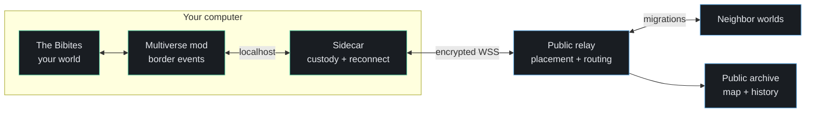

# Bibites Multiverse

**One simulation is a world. Connect them, and evolution gets a map.**

[Live map](https://bibitesmultiverse.com/) ·
[Install](docs/participant/install.md) ·
[Join](docs/participant/join.md) ·
[Participant guide](docs/README.md) ·
[Project status](m5_tracking.md)

Bibites Multiverse connects independent copies of *The Bibites* as neighboring ecosystems.
Organisms cross one simulation border and continue their lives in another world.

Every participant keeps a separate game, clock, ecosystem, and save history. This is not one
synchronized mega-simulation. It is an evolutionary continent made from worlds that remain local.

> [!IMPORTANT]
> **Bibites Multiverse `m5.0` is public.** Download the Windows or Linux add-on archive from the
> [release page](https://github.com/jpinedaa/bibites-multiverse/releases/tag/m5.0). These editions
> connect an existing game installation. Make sure that the SHA-256 matches before you extract it.
> Do not download a Multiverse build from another source.

## About *The Bibites*

[*The Bibites: Digital Life*](https://store.steampowered.com/app/2736860/The_Bibites_Digital_Life/)
is an artificial-life sandbox by Omnia Studios. Each bibite has genes and a neural-network brain
that can change across generations.

You create a world and set its physical and biological conditions. Natural selection does the
rest: creatures learn to find food, compete, cooperate, specialize, and form new species.
The game includes lineage views, genetic analysis, creature engineering, and world statistics.

You can get *The Bibites* on [Steam](https://store.steampowered.com/app/2736860/The_Bibites_Digital_Life/)
or [itch.io](https://thebibites.itch.io/the-bibites).

The base game asks what can evolve inside one world. Bibites Multiverse asks a second question:

> **What happens when evolution can leave home?**

Bibites Multiverse is an independent community project. It is not affiliated with or endorsed by
Omnia Studios.

## What the Multiverse adds

Each player still runs a complete local simulation. The Multiverse turns the borders between
those simulations into migration routes.

| 🧬 Evolution can travel | 🗺️ Every world stays independent |
|---|---|
| A border crossing can become a migration into another ecosystem. | Your clock, settings, saves, and simulation remain on your machine. |
| **↔️ Every edge is a route** | **🌐 The map survives churn** |
| North, east, south, and west can send and receive organisms. | Offline worlds are bypassed. Returning worlds reclaim their prior positions. |
| **📚 History remains visible** | **🔐 Each world has one identity** |
| The public archive follows migrations, lineage, species, and brain-complexity trends. | Each participant gets a separate credential that binds to one world. |

The result feels less like a multiplayer lobby and more like a continent with moving life.

## Install one world

The `m5.0` release turns the player setup into four steps:

1. Get one private join string from the map operator.
2. Download the archive for your platform and make sure that its checksum matches.
3. Extract the archive and run its installer.
4. Run the generated start script to open the sidecar and your world.

After checksum and extraction, the platform commands are:

| Platform | Supported game | Install | Start |
|---|---|---|---|
| Windows | *The Bibites* 0.6.3.1 from Steam | `.\Install-BibitesMultiverse.ps1` | `.\Start-Multiverse.ps1` |
| Linux | *The Bibites* 0.6.3.1 from itch.io | `./install-bibites-multiverse.sh` | `./start-multiverse.sh` |

Use `.\Start-Multiverse.ps1 -Headless` or `./start-multiverse.sh --headless` to run a world
without graphics. The simulation remains active.

The installer finds the game and makes sure that its build is supported. It installs the mod,
stores the credential, and creates the start and stop scripts. It needs no compiler, SDK,
administrator account, or root access.

The normal **add-on edition** connects an existing game installation. A **complete edition** can
include the game only when the publisher permits distribution.

[Read the full installation guide →](docs/participant/install.md)

## How it works

The mod detects border crossings. The sidecar records custody before it sends a migrant.
The relay assigns map positions and routes each migration. The archive records the public history.

Stable migration identities make retries safe. The design prefers a rare lost migration over a
duplicated organism because duplication changes the simulation permanently.

[Read the system design →](system_decomposition.md)

## Designed for players, not build machines

- The package includes the mod, BepInEx, the sidecar, and native platform scripts.
- The installer refuses unsupported game builds before it changes the game folder.
- The start script launches the sidecar before it launches the game.
- The stop script closes both processes without removing the world or its saves.
- The uninstaller keeps changed files and removes only files that its install record owns.
- Headless mode can run a world without graphics.

## Trust boundary

A connected world crosses a real network boundary. The package keeps that boundary explicit.

- Release archives carry SHA-256 checksums and an internal file manifest.
- TLS protects traffic between every sidecar and the relay.
- Join strings never belong in issue reports, screenshots, logs, or command lines.
- The sidecar accepts mod traffic only from the same computer.
- Your world and save files remain local.
- The participant guides state what the public service records and retains.

Read [what joining publishes](docs/participant/join.md#what-joining-publishes-about-your-world)
before you connect a world.

## Public map status

The hosted service is online at [bibitesmultiverse.com](https://bibitesmultiverse.com/).
The first announced period runs from **August 14 through November 14, 2026**.

The service is healthy and empty. No participant join string exists yet. Participant onboarding
starts after the `m5.0` release passes its final fleet-identity gate and reaches GitHub Releases.

## Explore the experiment

| Goal | Start here |
|---|---|
| Watch the public map and its evolutionary record | [Open the live map](https://bibitesmultiverse.com/) |
| Connect a world | [Read the participant guide](docs/README.md) |
| Understand the architecture | [Read the system design](system_decomposition.md) |
| Inspect the network protocol | [Read Contract B](contracts/contract-b-m4.md) |
| Report a defect or propose an experiment | [Open a GitHub issue](https://github.com/jpinedaa/bibites-multiverse/issues) |

Bug reports, documentation corrections, and reproducible experiment ideas are welcome.

## Repository guide

| Path | Purpose |
|---|---|
| [`release/`](release/) | Player installers, uninstallers, release assembly, and package tests |
| [`bibites-mod/`](bibites-mod/) | BepInEx and Harmony game plugin |
| [`go/`](go/) | Sidecar, relay, archive, diagnostics, and protocol tests |
| [`docs/`](docs/) | Participant guides, support matrix, and operator diagnostics |
| [`contracts/`](contracts/) | Versioned mod and network protocols |
| [`deploy/`](deploy/) | Public service provisioning, monitoring, backup, and recovery |
| [`e2e/`](e2e/) | Multi-world test rigs and failure rehearsals |

Developer entry points:

- [System architecture](system_decomposition.md)
- [Development environment](dev_environment.md)
- [Release engineering](release/README.md)
- [Mod-to-sidecar protocol](contracts/contract-a.md)
- [Sidecar-to-relay protocol](contracts/contract-b-m4.md)

## License

Original Bibites Multiverse work uses the [Apache License 2.0](LICENSE). Third-party components
and game payloads keep their own terms. See the [third-party notices](THIRD_PARTY_NOTICES.md).
