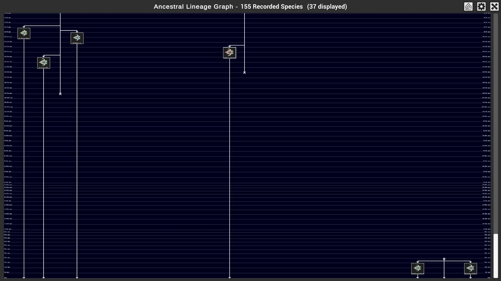
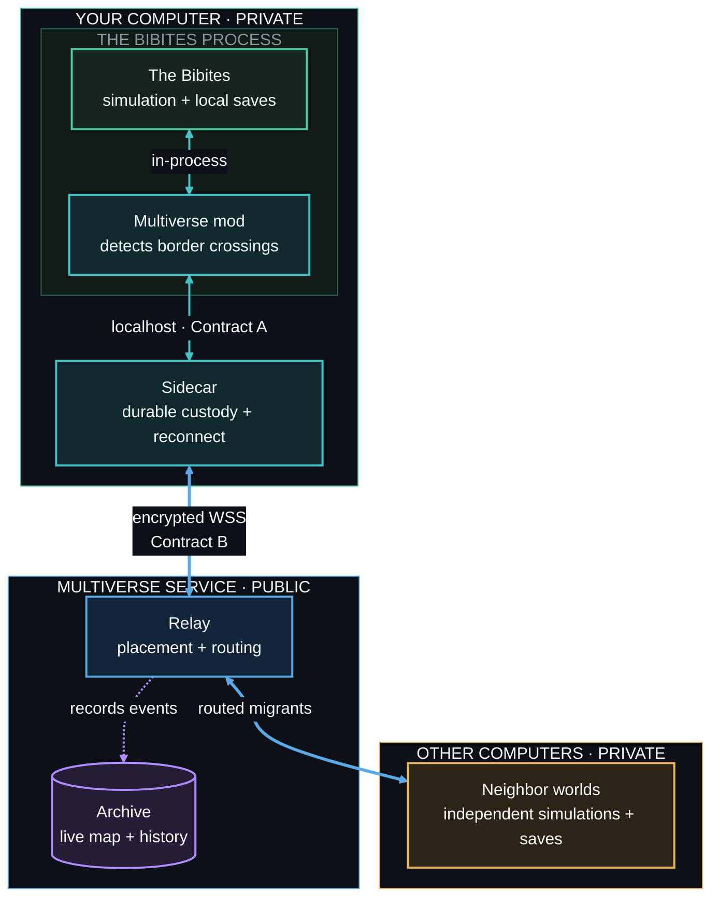

# Bibites Multiverse

**Artificial life, evolving across the network.**

[Website](https://bibitesmultiverse.com/) ·
[Live map](https://bibitesmultiverse.com/live) ·
[Watch live](https://bibitesmultiverse.com/watch) ·
[Install](docs/participant/install.md) ·
[Join](docs/participant/join.md) ·
[Participant guide](docs/README.md) ·
[Project status](STATUS.md)

Bibites Multiverse connects independent copies of *The Bibites* as neighboring ecosystems.
Organisms cross one simulation border and continue their lives in another world.

Every participant keeps a separate game, clock, ecosystem, and save history. This is not one
synchronized mega-simulation. It is an evolutionary continent made from worlds that remain local.

> [!IMPORTANT]
> **Bibites Multiverse `0.1.0` is public.** Download the Windows or Linux add-on archive from the
> [release page](https://github.com/jpinedaa/bibites-multiverse/releases/tag/v0.1.0). These editions
> connect an existing game installation. Make sure that the SHA-256 matches before you extract it.
> Do not download a Multiverse build from another source.

## About *The Bibites*

[*The Bibites: Digital Life*](https://store.steampowered.com/app/2736860/The_Bibites_Digital_Life/)
is an artificial-life sandbox by Omnia Studios. Every Bibite inherits mutable genes and a
neural-network brain.

You set the physical and biological conditions of a world. Natural selection shapes the creatures
that live there. Their bodies, brains, behavior, and species can change across generations.

You can get *The Bibites* on [Steam](https://store.steampowered.com/app/2736860/The_Bibites_Digital_Life/)
or [itch.io](https://thebibites.itch.io/the-bibites).

These screenshots come from real Multiverse saves loaded in the game.

<table>
<tr>
<td width="50%">

 <strong>A world that evolves itself.</strong> Food, movement, reproduction, predation, and mutation shape each local population.
</td>
<td width="50%">

 <strong>Brains evolve too.</strong> Each Bibite turns sensory inputs into actions through its own network of mutable nodes and connections.
</td>
</tr>
</table>

<strong>Speciation leaves a history.</strong> This real save has 155 recorded species. The game shows when living branches split from their ancestors.

Each simulation is a living world. Connect many of them, and artificial life can inhabit a digital
universe larger than any one computer.

> **What evolves when the network itself becomes a habitat?**

Bibites Multiverse is an independent community project. It is not affiliated with or endorsed by
Omnia Studios.

## What the Multiverse adds

Each player still runs a complete local simulation. The Multiverse turns the borders between
those simulations into migration routes.

| 🧬 Evolution can travel | 🗺️ Every world stays independent |
|---|---|
| A border crossing can become a migration into another ecosystem. | Your clock, settings, saves, and simulation remain on your machine. |
| **↔️ Every edge is a route** | **🌐 The map survives churn** |
| North, east, south, and west can send and receive organisms. | Offline worlds are bypassed. Returning worlds reclaim their prior positions. |
| **📚 History remains visible** | **🔐 Each world has one identity** |
| The public archive follows migrations, lineage, species, and brain-complexity trends. | Each participant gets a separate credential that binds to one world. |

The result feels less like a multiplayer lobby and more like a continent with moving life.

### The network in motion

<strong>One captured moment.</strong> The public map shows six live worlds, their populations, active lanes, and organisms in transit.

## Watch evolution unfold

### Species across the network

The [Species tab](https://bibitesmultiverse.com/live#species) joins live census reports with the
migration archive. It shows which species are alive, where they live, how their populations are
changing, and how complex their brains have become. It connects ancestry only when the migration
record has seen that lineage cross between worlds.

### One life at a time

The [live broadcast](https://bibitesmultiverse.com/watch) gives every visitor the same read-only
camera. It selects the youngest living Bibite and stays with that creature until it dies or leaves
the world. Then it chooses another. The image above is a real spectator-camera view from a
Multiverse save.

## Install one world

Release `0.1.0` turns the player setup into four steps:

1. Get one private join string from the map operator.
2. Download the archive for your platform and make sure that its checksum matches.
3. Extract the archive and run its installer.
4. Run the generated start script to open the sidecar and your world.

After checksum and extraction, the platform commands are:

| Platform | Supported game | Install | Start |
|---|---|---|---|
| Windows | *The Bibites* 0.6.3.1 from Steam | Double-click `Install-BibitesMultiverse.cmd` | `.\Start-Multiverse.ps1` |
| Linux | *The Bibites* 0.6.3.1 from itch.io | `./install-bibites-multiverse.sh` | `./start-multiverse.sh` |

Use `.\Start-Multiverse.ps1 -Headless` or `./start-multiverse.sh --headless` to run a world
without graphics. The simulation remains active.

The installer finds the game and makes sure that its build is supported. It installs the mod,
stores the credential, and creates the start and stop scripts. It needs no compiler, SDK,
administrator account, or root access.

Release `0.1.0` contains add-on packages. The installer finds an existing game automatically.

[Read the full installation guide →](docs/participant/install.md)

## How it works

The mod detects border crossings. The sidecar records custody before it sends a migrant.
The relay assigns map positions and routes each migration. The archive records the public history.

Stable migration identities make retries safe. The design prefers a rare lost migration over a
duplicated organism because duplication changes the simulation permanently.

[Read the system design →](system_decomposition.md)

## Designed for players, not build machines

- The package includes the mod, BepInEx, the sidecar, and native platform scripts.
- The installer refuses unsupported game builds before it changes the game folder.
- The start script launches the sidecar before it launches the game.
- The stop script closes both processes without removing the world or its saves.
- The uninstaller keeps changed files and removes only files that its install record owns.
- Headless mode can run a world without graphics.

## Trust boundary

A connected world crosses a real network boundary. The package keeps that boundary explicit.

- Release archives carry SHA-256 checksums and an internal file manifest.
- TLS protects traffic between every sidecar and the relay.
- Join strings never belong in issue reports, screenshots, logs, or command lines.
- The sidecar accepts mod traffic only from the same computer.
- Your world and save files remain local.
- The participant guides state what the public service records and retains.

Read [what joining publishes](docs/participant/join.md#what-joining-publishes-about-your-world)
before you connect a world.

## Public experiment

The hosted entry point is [bibitesmultiverse.com](https://bibitesmultiverse.com/).
The first announced service period runs from **August 14 through November 14, 2026**.
Read the [project status](STATUS.md) for the release and milestone state.

The homepage explains the experiment and shows a live summary. The
[live console](https://bibitesmultiverse.com/live) shows the map, migrations, species,
lineages, and world settings.

The [watch page](https://bibitesmultiverse.com/watch) has one shared game camera.
It follows the youngest living Bibite until that Bibite dies or leaves the world.
The page reconnects automatically when the broadcast host is offline.

## Explore the experiment

| Goal | Start here |
|---|---|
| Watch one Bibite live | [Open the shared broadcast](https://bibitesmultiverse.com/watch) |
| Watch the public map and its evolutionary record | [Open the live map](https://bibitesmultiverse.com/live) |
| Connect a world | [Read the participant guide](docs/README.md) |
| Understand the architecture | [Read the system design](system_decomposition.md) |
| Inspect the network protocol | [Read Contract B](contracts/contract-b-m4.md) |
| Report a defect or propose an experiment | [Open a GitHub issue](https://github.com/jpinedaa/bibites-multiverse/issues) |

Bug reports, documentation corrections, and reproducible experiment ideas are welcome.

## Repository guide

| Path | Purpose |
|---|---|
| [`release/`](release/) | Player installers, uninstallers, release assembly, and package tests |
| [`bibites-mod/`](bibites-mod/) | BepInEx and Harmony game plugin |
| [`go/`](go/) | Sidecar, relay, archive, diagnostics, and protocol tests |
| [`docs/`](docs/) | Participant guides, support matrix, and operator diagnostics |
| [`cloud/aws/`](cloud/aws/) | Cloud-world and GPU-broadcast deployment |
| [`contracts/`](contracts/) | Versioned mod and network protocols |
| [`deploy/`](deploy/) | Public service provisioning, monitoring, backup, and recovery |
| [`e2e/`](e2e/) | Multi-world test rigs and failure rehearsals |

Developer entry points:

- [System architecture](system_decomposition.md)
- [Live broadcast design and operations](docs/live-broadcast.md)
- [Developer guide and technical findings](dev_environment.md)
- [Release engineering](release/README.md)
- [Mod-to-sidecar protocol](contracts/contract-a.md)
- [Sidecar-to-relay protocol](contracts/contract-b-m4.md)

## License

Original Bibites Multiverse work uses the [Apache License 2.0](LICENSE). Third-party components
and game payloads keep their own terms. See the [third-party notices](THIRD_PARTY_NOTICES.md).
