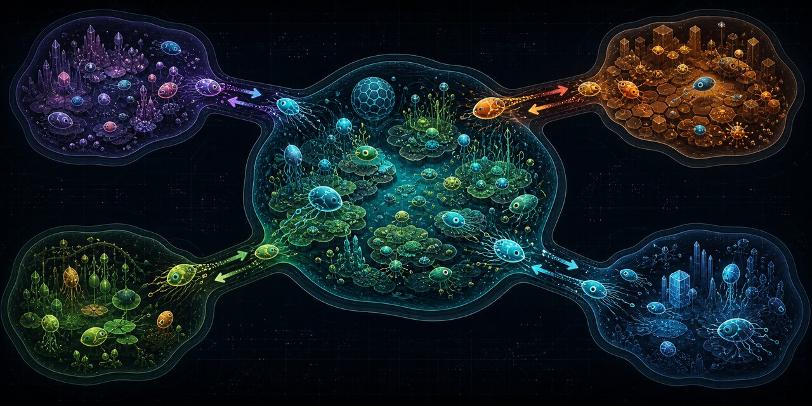
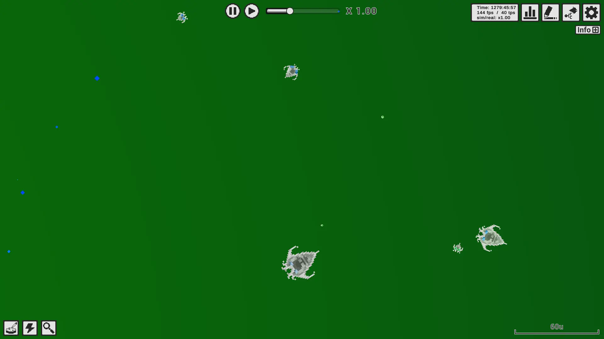
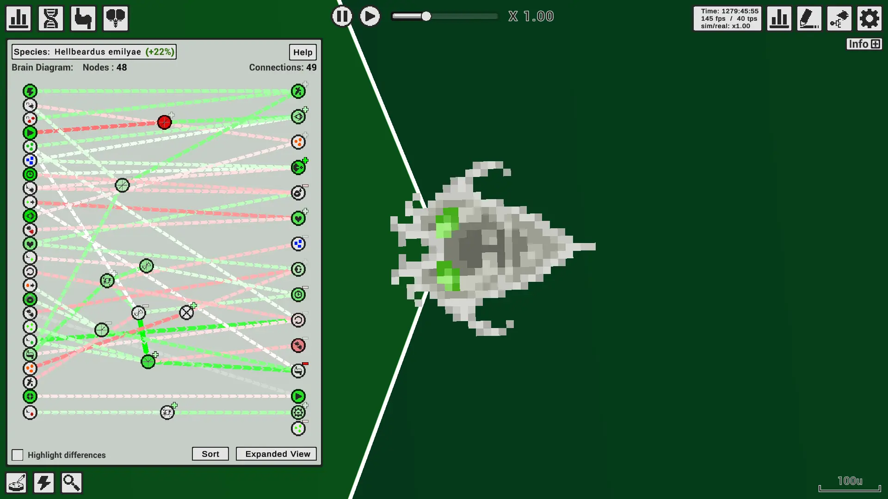
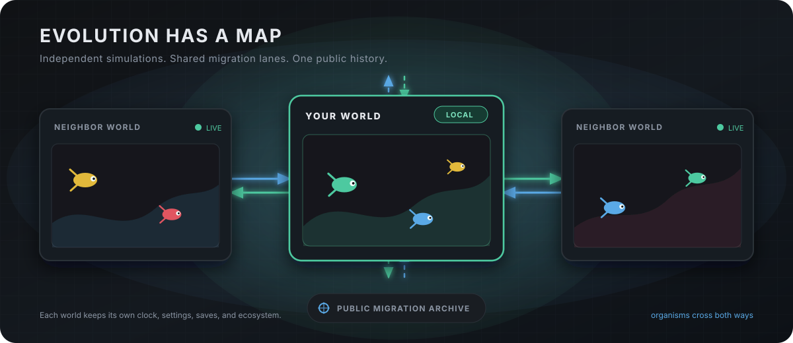
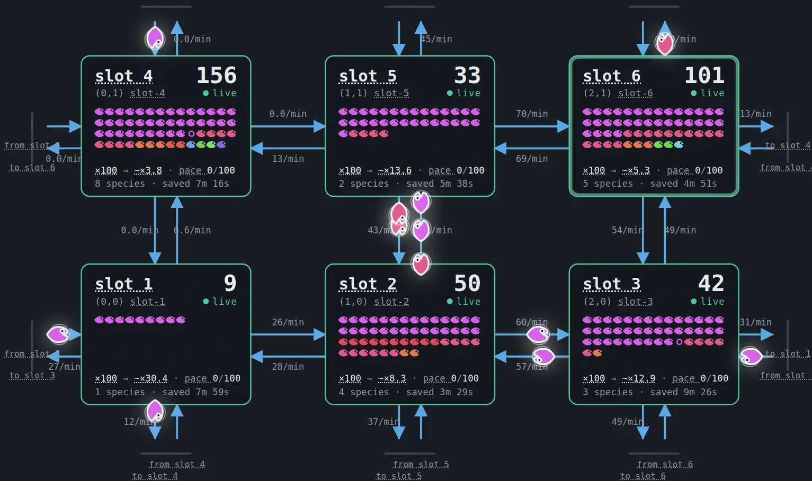
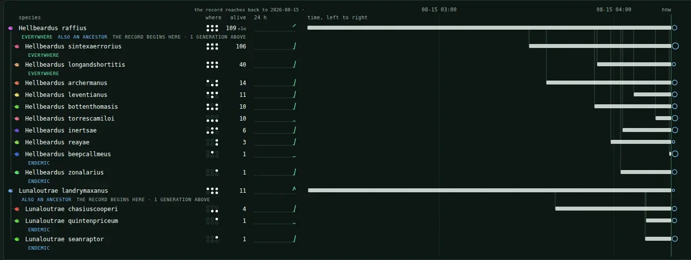
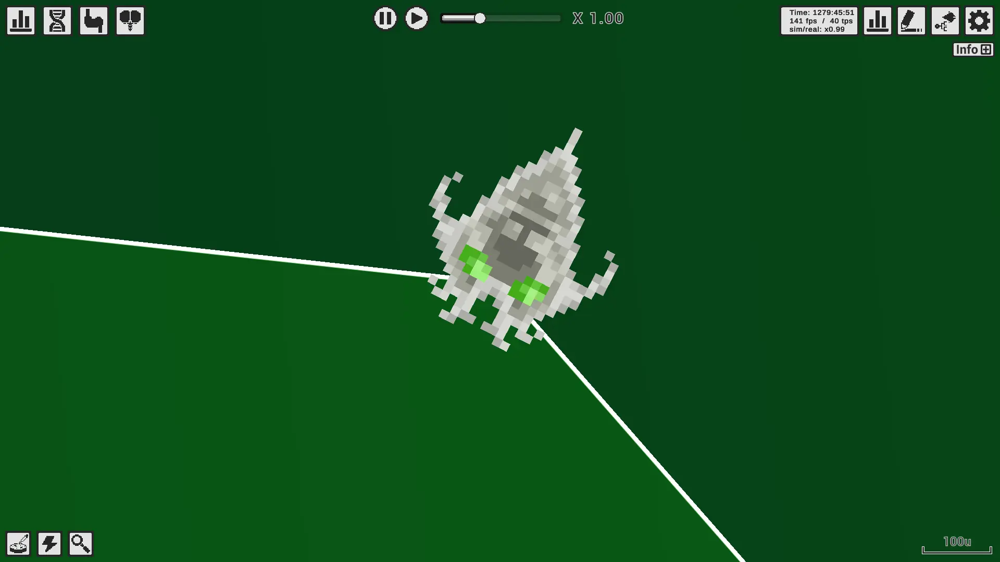
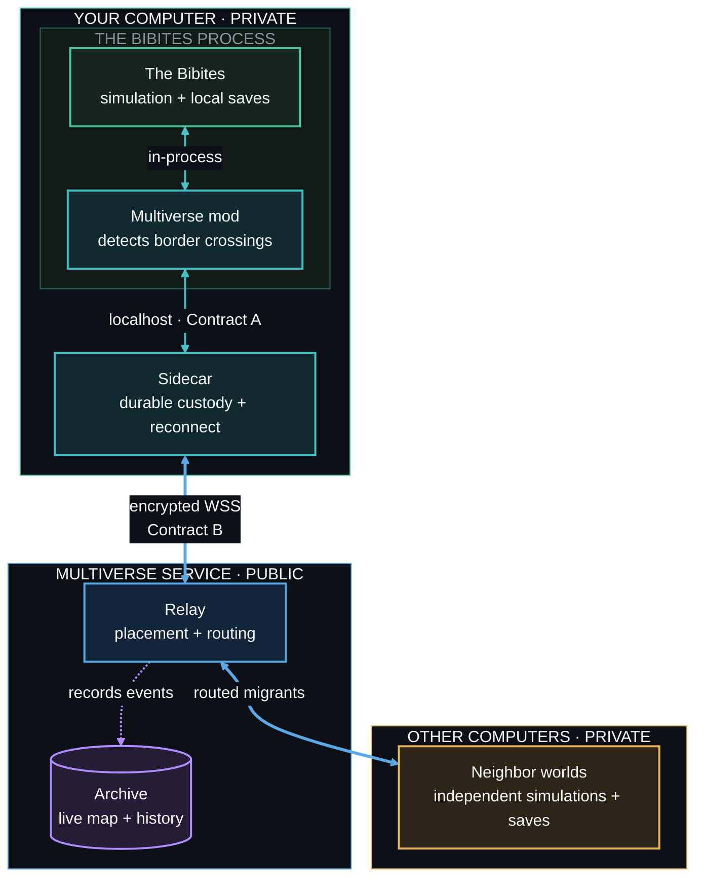

# Bibites Multiverse

**Artificial life, evolving across the network.**

[Watch broadcast](https://bibitesmultiverse.com/watch) ·
[Live map](https://bibitesmultiverse.com/live) ·
[Install a world](docs/participant/install.md) ·
[Project status](STATUS.md)

Bibites Multiverse connects independent copies of *The Bibites* as neighboring ecosystems.
Organisms cross one simulation border and continue their lives in another world.

Every participant keeps a separate game, clock, ecosystem, and save history. This is not one
synchronized mega-simulation. It is an evolutionary continent made from worlds that remain local.

## Start here

- **[Watch broadcast](https://bibitesmultiverse.com/watch).** See one shared game camera.
- **[Explore the live map](https://bibitesmultiverse.com/live).** Follow worlds, migrations,
  species, and lineages.
- **[Connect your world](docs/participant/install.md).** Use the Windows setup or Linux complete
  package. Add-on packages can use a supported game that you already have.

> [!IMPORTANT]
> **Bibites Multiverse `0.2.8` is public.** The Windows download is one setup executable with an
> authorized portable copy of *The Bibites*. It installs the Bibites Multiverse launcher — a
> window that lists your worlds, says what each one is doing and whether it has really reached the
> map, and starts, stops, creates, clones and checks them. Its commands ship beside it as
> `multiverse-launcher.exe` for scripts. The Linux complete
> download includes the native game. Add-on downloads remain available for an existing game. Get
> them from the
> [release page](https://github.com/jpinedaa/bibites-multiverse/releases/tag/v0.2.8), and check the
> SHA-256 before you run or extract a download.

## About *The Bibites*

[*The Bibites: Digital Life*](https://store.steampowered.com/app/2736860/The_Bibites_Digital_Life/)
is an artificial-life simulation created by Léo Caussan in 2017 and developed by
[Omnia Studios](https://www.thebibites.com/). Every Bibite inherits mutable genes and a
neural-network brain.

> [!NOTE]
> ***The Bibites* and Bibites Multiverse have different creators.** Bibites Multiverse is an
> independent passion project, built out of an interest in artificial life. It is not affiliated
> with, endorsed by, or sponsored by Léo Caussan or Omnia Studios.

You set the physical and biological conditions of a world. Natural selection shapes the creatures
that live there. Their bodies, brains, behavior, and species can change across generations.

You can get *The Bibites* on [Steam](https://store.steampowered.com/app/2736860/The_Bibites_Digital_Life/)
or [itch.io](https://thebibites.itch.io/the-bibites).

<table>
<tr>
<td width="50%">

 <strong>A world that evolves itself.</strong> Food, movement, reproduction, predation, and mutation shape each local population.
</td>
<td width="50%">

 <strong>Brains evolve too.</strong> Each Bibite turns sensory inputs into actions through its own network of mutable nodes and connections.
</td>
</tr>
</table>

Each simulation is a living world. Connect many of them, and artificial life can inhabit a digital
universe larger than any one computer.

> **What evolves when the network itself becomes a habitat?**

## What the Multiverse adds

Each player still runs a complete local simulation. The Multiverse turns the borders between
those simulations into migration routes.

| Feature | What it changes |
|---|---|
| 🧬 Traveling evolution | A Bibite that crosses a border can enter a neighboring ecosystem. |
| ↔️ Four migration routes | Each world can send and receive Bibites through its north, east, south, and west edges. |
| 🗺️ Independent worlds | Each player keeps a separate clock, settings, saves, and simulation. |
| 🌐 Stable map positions | Offline worlds are bypassed. Returning worlds reclaim their positions. |
| 📚 Public history | The archive records migrations, lineages, species, and brain-complexity trends. |
| 🔐 One world identity | Each credential belongs to one world and preserves its place on the map. |

The result feels less like a multiplayer lobby and more like a continent with moving life.

### The network in motion

<strong>One captured moment.</strong> The public map shows six live worlds, their populations, active lanes, and organisms in transit.

Use the map's **Fullscreen** control to fit the complete grid to the available screen. Each
population chart fits its visible minimum and maximum. Population history opens on **All time**,
and you can select **Last 24 hours** to focus on recent changes.

## Watch evolution unfold

### Species across the network

The [Species tab](https://bibitesmultiverse.com/live#species) joins live census reports with the
migration archive. It shows which species are alive, where they live, how their populations are
changing, and how complex their brains have become. It connects ancestry only when the migration
record has seen that lineage cross between worlds. Each brain chart fits its visible range, so
small changes remain clear.

### One life at a time

The [live broadcast](https://bibitesmultiverse.com/watch) gives every visitor the same read-only
camera. It selects the youngest living Bibite and stays with that creature until it dies or leaves
the world. Then it chooses another. The broadcast world is a participant of the same map, so a
followed Bibite can migrate to a neighbour. The page names that world and draws its place in the
map grid, and the live map badges that world on its map cell, in the worlds table, and in its
settings card, with each badge linking back. The image above is a real spectator-camera view from
a Multiverse save.

## Install one world

Windows is a single-file setup program that installs the Bibites Multiverse launcher — a window
that lists your worlds and starts, stops and manages them. Linux keeps its native complete
archive.

1. Download the recommended file for your platform. Compare it with the published
   [`SHA256SUMS`](https://github.com/jpinedaa/bibites-multiverse/releases/download/v0.2.8/SHA256SUMS)
   file.
2. On Windows, double-click the setup executable. On Linux, extract the archive and run
   `./install-bibites-multiverse.sh`.
3. Keep the defaults. Windows opens the included game and creates desktop and Start Menu icons.
   Later, use the **Bibites Multiverse** icon; it opens the launcher window, where **Start** runs
   the selected world.
   On Linux, run `./start-multiverse.sh` after installation.

All participant packages include `public-map.json`, the public join configuration. It contains
the deployed enrollment and relay addresses. It contains no world identity or secret. Each
installer creates a unique identity and secret. Private maps still use an operator-issued join
string.

After checksum verification, use these platform steps:

| Platform | Recommended download | Install | Start |
|---|---|---|---|
| Windows | [`bibites-multiverse-0.2.8-windows-x64-setup.exe`](https://github.com/jpinedaa/bibites-multiverse/releases/download/v0.2.8/bibites-multiverse-0.2.8-windows-x64-setup.exe) | Double-click the one downloaded file | Starts after install by default. Later use the **Bibites Multiverse** icon, which opens the launcher |
| Linux | [`bibites-multiverse-0.2.8-linux-x64-complete.zip`](https://github.com/jpinedaa/bibites-multiverse/releases/download/v0.2.8/bibites-multiverse-0.2.8-linux-x64-complete.zip) | `./install-bibites-multiverse.sh` | `./start-multiverse.sh` |

To run a world without graphics on Windows, tick **Run without a game window (headless)** in the
launcher window. It is that world's own setting and it is written the moment you tick it. For one
session only, the commands do it instead: `multiverse-launcher.exe start --headless`, and
`start --no-headless` draws it again. On Linux, use `./start-multiverse.sh --headless`. The
simulation remains active.

One Windows computer can run several worlds at the same time. **Create a world...** in the
launcher window, or `multiverse-launcher.exe profile create NAME --world NAME --sidecar-port 8788`,
adds a world with its own map identity, data folder, and sidecar port. One game folder supports
five worlds at once. Each extra world enrolls its own identity on the public map.

The Windows GUI uses the included portable game by default. You can instead select an existing
game. The GUI searches Steam and common install locations before it asks for a folder. Setup
registers Bibites Multiverse in Windows Settings and creates its launch icons. It needs no
compiler, SDK, or administrator account. Linux needs no root access.

[Read the full installation guide →](docs/participant/install.md)

## How it works

The mod detects border crossings. The sidecar records custody before it sends a migrant.
The relay assigns map positions and routes each migration. The archive records the public history.

Stable migration identities are what let a second copy of the same crossing be refused rather
than recorded twice. Nothing re-sends one. The design prefers a lost migration over a
duplicated organism because duplication changes the simulation permanently. An organism is
handed to its destination once. If it does not arrive, it is gone, and the map counts it.

[Read the system design →](system_decomposition.md)

## Local, private, and reversible

A connected world crosses a network boundary. The package limits what crosses that boundary.

- The recommended Windows setup and Linux complete package include the authorized game, mod,
  sidecar, and installer.
  Add-on packages use a game that is already on the computer.
- The installer refuses unsupported game builds before it changes the game folder.
- The launcher opens the sidecar before it opens the game, and closes both when you stop the
  world. The Linux start and stop scripts do the same.
- The uninstaller keeps changed files and removes only files that its install record owns.
- Your simulation, world, and save files remain on your computer.
- SHA-256 checksums and an internal file manifest protect the release package.
- The sidecar accepts mod traffic only from your computer. TLS protects traffic to the relay.
- Automatic enrollment creates the secret on your computer and sends it only to the HTTPS
  enrollment endpoint.
- Keep private-map join strings out of issue reports, screenshots, logs, and command lines.
- The participant guides state what the public service records and retains.

Before you connect a world, read
[what joining publishes](docs/participant/join.md#what-joining-publishes-about-your-world).

## Public experiment

The hosted entry point is [bibitesmultiverse.com](https://bibitesmultiverse.com/).
The first announced service period runs from **August 14 through November 14, 2026**.
Read the [project status](STATUS.md) for the release and milestone state.

The homepage explains the experiment and shows a live summary. Its download section walks a
Windows reader through the install in five steps — the setup, the SmartScreen warning, Install
itself, the launcher, and stopping — and points at the
[install guide](docs/participant/install.md) for Linux. The
[live console](https://bibitesmultiverse.com/live) shows the map, migrations, species,
lineages, and world settings.

The [broadcast page](https://bibitesmultiverse.com/watch) shows one shared game camera.
It follows one world on the map, names that world with its place in the grid, and reconnects
after a broadcast interruption.

## Repository guide

| Path | Purpose |
|---|---|
| [`release/`](release/) | Player installers, uninstallers, release assembly, and package tests |
| [`bibites-mod/`](bibites-mod/) | BepInEx and Harmony game plugin |
| [`go/`](go/) | Sidecar, relay, archive, diagnostics, and protocol tests |
| [`docs/`](docs/) | Participant guides, support matrix, and operator diagnostics |
| [`cloud/aws/`](cloud/aws/) | Cloud-world and GPU-broadcast deployment |
| [`contracts/`](contracts/) | Versioned mod and network protocols |
| [`deploy/`](deploy/) | Public service provisioning, monitoring, backup, and recovery |
| [`e2e/`](e2e/) | Multi-world test rigs and failure rehearsals |

Developer entry points:

- [System architecture](system_decomposition.md)
- [Live broadcast design and operations](docs/live-broadcast.md)
- [Developer guide and technical findings](dev_environment.md)
- [Release engineering](release/README.md)
- [Mod-to-sidecar protocol](contracts/contract-a.md)
- [Sidecar-to-relay protocol](contracts/contract-b-m4.md)
- [Public installer enrollment](contracts/public-enrollment.md)
- [Project status](STATUS.md)

[Open a GitHub issue](https://github.com/jpinedaa/bibites-multiverse/issues) to report a defect,
correct documentation, or propose a reproducible experiment.

## License

Original Bibites Multiverse work uses the [Apache License 2.0](LICENSE). Third-party components
and game payloads keep their own terms. See the [third-party notices](THIRD_PARTY_NOTICES.md).
