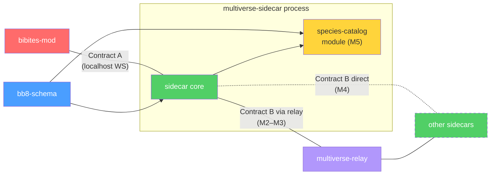

# Bibites Multiverse — System Decomposition

## The Picture

```
  ┌──────────────────────────────────────────────────────────────────┐
  │                         One Peer Node                           │
  │                                                                 │
  │  ┌─────────────┐    Contract A     ┌──────────────────────┐     │
  │  │  BepInEx Mod │◄── localhost ───►│   Sidecar Daemon      │     │
  │  │    (C#)      │    WebSocket     │        (Go)           │     │
  │  └──────┬───────┘                  └──────────┬───────────┘     │
  │         │                                     │                 │
  │         │ Harmony patches                     │ Contract B      │
  │         ▼                                     │ (wire protocol) │
  │  ┌─────────────┐                              │                 │
  │  │  The Bibites │                              │                 │
  │  │   (Unity)    │                              │                 │
  │  └─────────────┘                              │                 │
  └───────────────────────────────────────────────┼─────────────────┘
                                                  │
   Sidecar↔sidecar transport is phased. Contract B message shapes are
   identical in both phases — only the pipe changes:

   Phase 1 (M2–M3): star through the relay     Phase 2 (M4): direct mesh
   ─────────────────────────────────────────   ──────────────────────────
              ┌──────────────────┐                 Peer B ◄────► Peer C
    Peer B ──►│ multiverse-relay │◄── Peer C          ▲            ▲
    Peer D ──►│ (spatial router) │                    └── Peer D ──┘
              └──────────────────┘             (relay degrades to bootstrap)
```

---

## Design Decisions

Recorded so divergences are deliberate, not accidental. Section references (§) are to
`initial_research.md`.

| # | Decision | Why | Consequence |
|---|---|---|---|
| **D1** | **Relay-first, P2P-ready.** MVP transport is a deliberately dumb relay server (the topology §6.1 recommends); direct libp2p arrives in M4 behind unchanged Contract B message shapes. | Full P2P puts NAT traversal, gossip, DHT, and CRDTs on the critical path, and the research itself judged a pure mesh unviable. The sidecar boundary means the mod never notices the transport change. | New `multiverse-relay` component. Sector assignment is relay-arbitrated until M4. |
| **D2** | **Durable custody handoff, idempotent delivery.** The sidecar journals an organism to disk *before* ACKing `MIGRATE_OUT`; receivers dedup on `migrationId`; failed deliveries bounce back into the local sim. Preference: rare loss over duplication. | Destroy-on-ACK without persistence silently kills organisms on any crash; retries without dedup clone them. Loss reads as natural death; duplication reads as cloning. | Contract A gains `MIGRATE_IN_ACK/NACK`; the envelope gains `migrationId`; the sidecar owns a migration journal. See the custody chain under Contract A. |
| **D3** | **Map-edge borders; gateway towers deferred.** Migration triggers at designated map edges, and the mod owns suppressing void-avoidance at open edges — vanilla AI otherwise avoids borders and migration rates would be near zero (§5.1). | Edges preserve the illusion of one continuous world. Towers (§5.3) remain the fallback if crossing rates stay too low even with suppression — revisit at M3. | Mod owns the void-avoidance override; the sidecar tells the mod which edges are open (`EDGE_STATUS`). |
| **D4** | **The bb8 body is opaque to the mod.** The mod ships the game's own Newtonsoft output as a version-tagged blob; parsing, validation, and indexing live only in the sidecar's `bb8-schema`. | The authoritative serializer is the game itself. One schema implementation instead of two, no cross-language fidelity risk, and the mod survives game updates that add fields. | `bb8-schema` needs no C# implementation. All payload validation happens sidecar-side, before anything reaches a mod. |
| **D5** | **No global clock.** Every sector runs at its own sim speed; envelope timestamps are informational; a migrating organism may experience time discontinuities. | Peers' sim speeds differ by hardware and settings; synchronizing would couple every peer to the slowest. | Age/season continuity across sectors is explicitly not guaranteed. |
| **D6** | **Species catalog is a module inside the sidecar, post-MVP (M5).** | It shares the sidecar's storage and (later) DHT; a standalone service created a circular dependency in the earlier draft. | Off the MVP critical path. |
| **D7** | **Sidecar and relay are written in Go.** | go-libp2p is the reference libp2p implementation, which settles the M4 transport. A single static binary is also the easiest thing to ask a player to run alongside the mod. | `multiverse-sidecar`, `multiverse-relay`, and `bb8-schema` are Go. `bb8-schema` needs no second implementation — D4 already removed the C# side. |

The project owner ratified D1 (relay-first), D2 (at-most-once custody), and D3
(edges-over-towers) on 2026-08-02; they are settled, not provisional.

---

## Components

### 1. `bb8-schema` — The Data Language
**What it is:** A library that parses, validates, and serializes migration payloads.
**Language:** Go, sidecar-side only — the mod treats payloads as opaque blobs (D4, D7).
**Depends on:** Nothing. Pure data.
**Tested by:** Unit tests against real `.bb8` files from the community.

**Owns:**
- Gene array structure (flat floats)
- Node registry (48 standard: 33 input + 15 output, hidden nodes at index 48+)
- Synapse structure (`NodeIn`, `NodeOut`, `Weight` as float|string, `En` as bool)
- Validation rules: no input→input synapses, index bounds, weight type handling,
  gene bounds, NaN/Inf rejection, synapse-count and blob-size caps
- Live attribute schema (health, energy, stomach, maturity, size, position, velocity)
- Dialect detection: a `.bb8` written by the game's own `SaveSystem.SaveBibite` carries
  full live state under a `body` key; a `.bb8template` (and community template exports)
  carry genes + brain topology only
- Payload-kind registry: `bibite` now; `corpse`/`pellet`/`egg` shapes later (§6.4)
- Versioning — tagged with the game version it targets; cross-version conversion
  (prior art: EinsteinEditor's auto-conversion). Version ordering must match the game's
  `Utility.Version` semantics, alpha quirk included (see the research table below)

---

### 2. `bibites-mod` — The Game Hook
**What it is:** A BepInEx/HarmonyX plugin installed into The Bibites.
**Language:** C# (.NET Standard), referencing the game's Managed DLLs.
**Depends on:** Game's Managed DLLs and `Newtonsoft.Json.UnityConverters.dll` only —
no `bb8-schema` (D4).
**Tested by:** In-game manual testing; the M1 round-trip spike is its first exit test.

**Owns:**
- Harmony patches on `SimulationScripts.BibiteScripts.BibiteBody` (the live organism
  class; `BibiteBody.FixedUpdate()` is the per-organism tick)
- Border detection (position check each `FixedUpdate()`, hysteresis zone)
- **Void-avoidance suppression at open edges** (D3) — without it, migration ~never happens
- Export: game-native serialize (`SaveSystem.SerializeBibite`) → opaque blob + version
  tag + exit edge + border position + velocity → `MIGRATE_OUT` → destroy locally
  **only on `MIGRATE_OUT_ACK`** (custody transferred, D2). Local removal is a raw
  `Object.Destroy` after de-listing from `BibiteTracker` — no corpse, no meat, no eggs
- Import: `MIGRATE_IN` → thread-safe queue → `FixedUpdate()` dequeue → native
  full-state restore (`SaveSystem.LoadBibiteOrEggFromData`, which preserves the entity
  ID and needs no state overwrite) → re-link parent/child references →
  **report `MIGRATE_IN_ACK/NACK`**
- All Unity main-thread constraints (instantiation, destroy, transform writes)
- Config: sector bounds, sidecar address/port, migration cooldown

The mod knows nothing about topology or destinations — only which of its own edges are
currently open (`EDGE_STATUS`). Routing is the sidecar's job.

---

### 3. `multiverse-sidecar` — The Network Brain
**What it is:** A standalone daemon that handles all networking and custody.
**Language:** Go — go-libp2p for M4, and one static binary for players to run (D7).
**Depends on:** `bb8-schema`. Contains the `species-catalog` module (D6).
**Tested by:** Integration tests with multiple sidecar instances, no game needed.

**Owns — in every phase:**
- Localhost API server (Contract A — serves the mod)
- Migration journal: durable custody of in-flight organisms, recovery on restart (D2)
- Routing: exit edge → destination peer (the mod never sees this)
- Payload validation via `bb8-schema` — nothing invalid ever reaches a mod, in
  either direction
- Admission control: inbound migration rate limits, population-aware via `HEARTBEAT`
- Bounce-back: re-inject an organism locally when remote delivery fails
- Compatibility handshake (game version + mod list on peer connect)

**Owns — M2–M3 (relay transport):**
- Relay client connection (TLS)

**Owns — M4 (direct P2P):**
- libp2p transport, NAT traversal (hole punching, STUN, relay fallback)
- Peer discovery (bootstrap nodes, mDNS for LAN, peer exchange)
- Gossip-based topology dissemination; lease-based sector claims (design open)

---

### 4. `multiverse-relay` — The Spatial Router (MVP transport)
**What it is:** A small, deliberately dumb server that forwards Contract B frames
between sidecars and arbitrates the sector map. It never parses bb8 bodies.
**Language:** Go, same as the sidecar (shared framing code) (D7).
**Depends on:** Contract B envelope framing only.
**Tested by:** Integration tests with N sidecar instances.

**Owns:**
- Peer registry and connections
- Sector assignment: the single arbiter of who owns which sector (until M4's leases)
- Frame forwarding (`MIGRATION_PAYLOAD`, ACKs, etc.)
- Compatibility enforcement at connect (reject mismatched game/mod versions)
- Liveness: dead peers dropped, their sectors marked vacant, neighbors' edges closed
  (ripples to mods via `EDGE_STATUS`)
- **M4 role:** degrades to bootstrap/rendezvous node + relay-of-last-resort for
  unpunchable NATs

Open: who operates it (see research table).

---

### 5. `species-catalog` — The Distributed Library (module, M5)
**What it is:** Content-addressed storage and replication of `.bb8` genomes, as a
module inside the sidecar (D6).
**Depends on:** `bb8-schema` (indexing/metadata), sidecar storage and (M4) DHT.
**Tested by:** Unit tests for storage, integration tests for replication.

**Owns:**
- Content-addressed storage (hash → `.bb8` file)
- DHT-based lookup (find which peers have a given genome)
- Selective replication (peer chooses what to cache based on interest/capacity)
- Browse/search API (by species traits, lineage, neural complexity)
- Background lazy replication (not latency-sensitive)

---

## Contracts

### Contract A: Mod ↔ Sidecar (localhost)

Transport: WebSocket on `localhost:{configured_port}`
Format: JSON messages with a `type` discriminator

```
Direction: Mod → Sidecar
─────────────────────────
MIGRATE_OUT        Organism hit an open edge: opaque bb8 blob + game version +
                   exit edge + border position + velocity
MIGRATE_IN_ACK     Incoming organism spawned and overwritten successfully (migrationId)
MIGRATE_IN_NACK    Spawn failed (deserialization error, sim overloaded) — sidecar
                   keeps custody
HEARTBEAT          Mod is alive: current sim tick, population count (feeds admission
                   control)
CONFIG_UPDATE      Sector bounds changed, mod settings changed

Direction: Sidecar → Mod
─────────────────────────
MIGRATE_IN         Incoming organism: bb8 blob + entry coords + velocity + migrationId
MIGRATE_OUT_ACK    Organism durably journaled, custody transferred — mod destroys it now
MIGRATE_OUT_NACK   Sidecar can't take custody (edge has no live neighbor, journal
                   full, incompatible) — mod keeps the organism
EDGE_STATUS        Which edges (N/S/E/W) are currently open for migration — drives
                   the mod's void-avoidance suppression
```

> [!IMPORTANT]
> This is the **only** interface the mod needs to know about. It never touches the
> network and never sees topology — only per-edge open/closed status. The sidecar is
> a black box to the mod.

**The custody chain (D2):**

1. Mod sends `MIGRATE_OUT`.
2. Sidecar validates, journals to disk, replies `MIGRATE_OUT_ACK`. Custody: sidecar.
   Mod destroys the organism.
3. Sidecar sends `MIGRATION_PAYLOAD` (via relay in M2–M3, direct in M4).
4. Receiving sidecar validates, admission-checks, journals, sends `MIGRATE_IN` to its
   mod. Mod restores the organism from the blob and re-links its parent/child
   references, then replies `MIGRATE_IN_ACK`.
5. Receiving sidecar sends `MIGRATION_ACK`; the sender deletes its journal entry.
6. Any remote NACK or timeout → the sender re-injects the organism into its own sim
   via `MIGRATE_IN` at the same edge (bounce-back).
7. Receivers dedup `MIGRATION_PAYLOAD` on `migrationId`, so a resend after a lost ACK
   is idempotent. Loss is possible only if a journal is destroyed mid-flight — and
   reads as death (D2).

---

### Contract B: Sidecar ↔ Sidecar (wire protocol)

Transport: relay-forwarded frames over TLS (M2–M3), libp2p streams (M4). Same shapes
in both phases (D1).
Format: TBD (Protobuf likely for the envelope — the bb8 body stays an opaque bytes
field per D4)

```
HANDSHAKE          Game version, mod list, node count, protocol version
SECTOR_CLAIM       Request/renew a sector — relay-arbitrated in M2–M3; lease-based
                   design open for M4
TOPOLOGY_GOSSIP    Sector-map dissemination (M4 only — before that the relay is the
                   single source of truth)
MIGRATION_PAYLOAD  MigrationEnvelope (Contract C); receivers dedup on migrationId
MIGRATION_ACK      Receiving mod confirmed the spawn (sent only after MIGRATE_IN_ACK)
                   — sender clears its journal entry
MIGRATION_NACK     Rejected (incompatible, overloaded, invalid payload) — sender
                   bounces the organism back locally
PEER_EXCHANGE      Share known peer addresses (M4)
CATALOG_QUERY      Request a bb8 by content hash (M5)
CATALOG_RESPONSE   Return a bb8 file, or "not found, try these peers" (M5)
PING / PONG        Liveness
```

---

### Contract C: MigrationEnvelope + bb8-schema (shared data model)

Not a network contract — a **code contract** over what a migration carries:

```
MigrationEnvelope
├── migrationId: uuid                  # idempotency key — receivers dedup on it
├── kind: enum(bibite, corpse, pellet, egg)  # MVP ships bibite; others are
│                                      #   protocol-ready for M5 (§6.4)
├── body: (by kind, below)
├── sourcePeer: string                 # peer ID of sender
├── sourceSector: {x, y}
├── destSector: {x, y}
├── exitEdge: enum(N, S, E, W)         # which border it crossed
├── exitPosition: float                # 0..1 along that edge — receiver mirrors it
│                                      #   into entry coordinates
├── velocity: {x, y}
└── timestamp: int64                   # unix millis, informational only (D5)

body when kind = bibite:
├── version: string                    # game version that serialized it
└── bb8: string                        # the game's own Newtonsoft output — opaque to
                                       #   the mod (D4), parsed sidecar-side

body when kind = corpse | pellet (M5):
├── mass, material, decayState

body when kind = egg (M5): shape TBD — open research
```

Delivery is single-hop (sender → receiver, the relay merely forwards), so there is no
TTL/hop counter and no store-and-forward routing.

What `bb8-schema` validates inside the `bibite` blob:

```
BibitePayload
├── genes: float[]                     # physical stats
├── nodes: Node[]                      # brain neurons
│   ├── typeName: string               #   activation function (ReLu, TanH, Linear...)
│   ├── index: int                     #   0-47 = standard, 48+ = hidden
│   └── desc: string                   #   human-readable name
├── synapses: Synapse[]                # brain connections
│   ├── nodeIn: int                    #   source node index
│   ├── nodeOut: int                   #   target node index
│   ├── weight: float | string         #   signal multiplier OR gene reference
│   └── en: bool                       #   active/dormant
└── liveState: LiveState               # the game's own .bb8 already persists all of
                                       #   this; only .bb8template strips it
    ├── health, energy, stomach, maturity, size, age: float
    ├── position: {x, y}
    ├── velocity: {x, y}
    └── dying: bool
```

---

## Dependency Graph



Note the mod no longer depends on `bb8-schema` (D4).

---

## Milestones

Vertical slices, riskiest first — not component-by-component. `bb8-schema` is not a
standalone first step: its real shape is discovered in M1 and hardens through M2–M3.

### M1 — In-game round trip (the de-risking spike) — **COMPLETE**
One game instance, no sidecar, no network. A dev command in the mod: serialize a live
organism (genes + brain + live state) → destroy it → respawn via the game's own
full-state restore (`SaveSystem.LoadBibiteOrEggFromData`, ID preserved) → re-link its
parent/child references.
**Exit test:** the organism resumes life with no observable change — same brain
topology, stomach contents, maturity — and a subsequent world save still succeeds.
**Passed 2026-08-02**, on two unattended runs against game `0.6.3.1`: run 2 compared the
before/after payloads as **EQUAL token for token**, the entity ID survived, and the game's
own world save completed with no exception. The whole exit test now runs headless from
`bibites-mod/src/AutoTest.cs` (`MULTIVERSE_AUTOTEST=1`), including seeding and loading its
own world. Carried to M2: the re-link code ran against an organism that had no parents and
no children, so the stale-reference trap is still unexercised. Full results in
`m1_findings.md`, *Runtime results*.
**Why first:** every high-risk unknown in the table below lived here (spawn API,
state access, destroy safety), and its findings define the true payload shape.
The decompiled-source pass (`m1_findings.md`) closed the spawn-API, state-access and
payload-fidelity unknowns; the in-game run has now confirmed them.

### M2 — Two sims, one machine
Trivial relay (frame forwarding + a two-sector registry), sidecar skeleton, Contract A,
and the full custody chain — all on localhost. Void-avoidance suppression on one
designated edge per sim.
**Exit test:** an organism crosses from sim A to sim B and back; `kill -9` any process
mid-migration and no organism is ever duplicated (rare loss acceptable).
**Prerequisite — confirmed 2026-08-02:** two game instances do run side by side on one
machine (see the research table), so the two-machine LAN fallback is not needed.
**Also carried in from M1:** re-run the round trip on an organism that actually has living
parents and children — M1 exercised the re-link code against an organism with no links.

### M3 — Real network, N peers
Hosted relay; handshake/compat enforcement; admission control; journal recovery
hardening; `EDGE_STATUS` ripple on peer death; migration-rate tuning — is D3's edge
suppression enough, or do we need gateway towers after all?
**Exit test:** a small community playtest — a handful of strangers' sims exchanging
organisms for days without operator intervention.

### M4 — Direct P2P
libp2p transport behind unchanged Contract B shapes; NAT traversal; peer discovery;
gossip topology; lease-based sector claims. The relay degrades to bootstrap +
relay-of-last-resort.

### M5 — Ecosystem completeness
Corpse and pellet payloads for biomass continuity (§6.4); egg-handling research;
species-catalog module.

---

## What We Know vs. What We Need to Research

| Component | What we know (from research doc) | What we need to figure out |
|---|---|---|
| `bb8-schema` | JSON structure, node layout, synapse rules, gene array, weight polymorphism, validation constraints. From `m1_findings.md`: the game's `.bb8` top-level keys (`transform`, `rb2d`, `genes`, `body`, `clock`, `brain`, `version`, `desc`) and the fact that a `.bb8` carries full live state while a `.bb8template` does not; genes are keyed by enum **name**, so gene reordering is safe and only additions/removals need conversion; **the `Utility.Version` alpha quirk** — a 4-argument `new Version(0,6,3,3)` binds to the alpha overload and means `0.6.3a3`, *not* `0.6.3.3`, and `V3` sorts before `Alpha`, so `bb8-schema` must reproduce that ordering | Version differences between game updates; cross-version conversion (EinsteinEditor prior art); the exact byte shape of community-tool `.bb8` dialects; whether Newtonsoft honours `[NonSerialized]` on `NEATBrain.Node.NIn/NOut` in the shipped DLL; corpse/pellet/egg payload shapes (M5) |
| `bibites-mod` | BepInEx/Harmony setup, export/import patterns, threading constraints, the Constance-Mod overwrite technique (now only needed for the egg-hatch fallback). From `m1_findings.md`: exact signatures in `BibitesAssembly.dll`; spawn/restore API (`SaveSystem.LoadBibiteOrEggFromData`, public, no mutation, ID-preserving); serialize API (`SaveSystem.SerializeBibite`/`SaveBibite`); live-attribute access is public except `InternalClock` (covered by public `SerializationHelper.DeserializeObject`, so no mod-side reflection); no ID registry exists — IDs are random int32; clean removal is raw `Object.Destroy` after de-listing from `BibiteTracker`; patch targets (`BibiteBody.FixedUpdate()`, `EggHatching.Hatch()`). **Confirmed in-game 2026-08-02** (`m1_findings.md`, *Runtime results*): the round trip is byte-exact, the ID survives, and the world save that follows succeeds; `GameManager.StartGame(path)` loads a named world headlessly, and `SaveSystem.CreateSave` must be driven by hand because the public `SaveGame` wrapper swallows save exceptions inside a coroutine. **Two game instances do run at once on one machine** — verified 2026-08-02: both processes persisted, and BepInEx gave the second instance `BepInEx/LogOutput.log.1` because the first holds a lock on `LogOutput.log`, so neither log is truncated | Re-linking parent/child references after respawn: implemented, but M1 exercised it against an organism with **no** parents and **no** children, so the stale-reference trap that breaks the *next* world save is still unproven — re-test in an evolved world (M2); **how to suppress void-avoidance per edge (D3)**; per-instance mod config for the M2 rig, since both instances share one plugin DLL and one BepInEx config directory; `.csproj` HintPaths |
| `multiverse-sidecar` | Custody chain and journal semantics (D2); admission-control levers | Journal format and crash recovery; Contract A reconnection semantics (replay of un-acked `MIGRATE_IN`s); go-libp2p maturity (M4); lease design and churn healing for sector claims (M4) |
| `multiverse-relay` | Star routing and single-arbiter sector assignment are well-trodden | **Who operates it** (and later the bootstrap nodes); sector assignment policy (user-chosen vs auto); capacity and abuse limits |
| `species-catalog` | Community already shares `.bb8` on GitHub/Steam Workshop; content-addressing makes sense | Storage limits, search/index strategy, replication policy (all M5) |
| **Contract A** | Message types and the custody chain | Exact JSON message schemas; NACK error taxonomy |
| **Contract B** | Migration payloads = envelope + opaque body; ACK gated on the receiving mod's `MIGRATE_IN_ACK` | Protobuf vs JSON framing; encryption (TLS to relay in M2–M3, libp2p secure channels in M4); protocol versioning |
