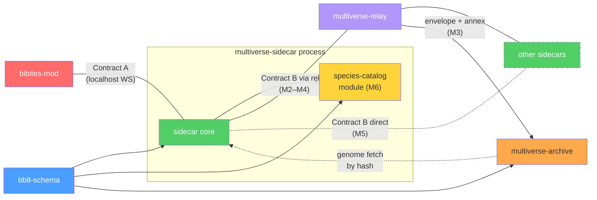

# Bibites Multiverse — System Decomposition

## The Picture

```
  ┌──────────────────────────────────────────────────────────────────┐
  │                         One Peer Node                           │
  │                                                                 │
  │  ┌─────────────┐    Contract A     ┌──────────────────────┐     │
  │  │  BepInEx Mod │◄── localhost ───►│   Sidecar Daemon      │     │
  │  │    (C#)      │    WebSocket     │        (Go)           │     │
  │  └──────┬───────┘                  └──────────┬───────────┘     │
  │         │                                     │                 │
  │         │ Harmony patches                     │ Contract B      │
  │         ▼                                     │ (wire protocol) │
  │  ┌─────────────┐                              │                 │
  │  │  The Bibites │                              │                 │
  │  │   (Unity)    │                              │                 │
  │  └─────────────┘                              │                 │
  └───────────────────────────────────────────────┼─────────────────┘
                                                  │
   Sidecar↔sidecar transport is phased. Contract B message shapes are
   identical in both phases — only the pipe changes:

   Phase 1 (M2–M4): star through the relay     Phase 2 (M5): direct mesh
   ─────────────────────────────────────────   ──────────────────────────
              ┌──────────────────┐                 Peer B ◄────► Peer C
    Peer B ──►│ multiverse-relay │◄── Peer C          ▲            ▲
    Peer D ──►│ (spatial router) │                    └── Peer D ──┘
              └──────────────────┘             (relay degrades to bootstrap)

   The wiring is a star; the *map* is a ring (D8). Each peer exports through its
   east edge into its one east neighbour and receives through its west edge —
   B → C → D → B, one way round. `multiverse-archive` (D11) sits beside the relay
   from M3 and records every envelope that crosses it.
```

---

## Design Decisions

Recorded so divergences are deliberate, not accidental. Section references (§) are to
`initial_research.md`.

| # | Decision | Why | Consequence |
|---|---|---|---|
| **D1** | **Relay-first, P2P-ready.** MVP transport is a deliberately dumb relay server (the topology §6.1 recommends); direct libp2p arrives in M5 behind unchanged Contract B message shapes. | Full P2P puts NAT traversal, gossip, DHT, and CRDTs on the critical path, and the research itself judged a pure mesh unviable. The sidecar boundary means the mod never notices the transport change. | New `multiverse-relay` component. Ring insertion (D8) is relay-arbitrated until M5. "Dumb" is load-bearing: it is why the organism database is a separate service (D11) and not a relay feature. |
| **D2** | **Durable custody handoff, idempotent delivery.** The sidecar journals an organism to disk *before* ACKing `MIGRATE_OUT`; receivers dedup on `migrationId`; failed deliveries bounce back into the local sim. Preference: rare loss over duplication. | Destroy-on-ACK without persistence silently kills organisms on any crash; retries without dedup clone them. Loss reads as natural death; duplication reads as cloning. | Contract A gains `MIGRATE_IN_ACK/NACK`; the envelope gains `migrationId`; the sidecar owns a migration journal. See the custody chain under Contract A. |
| **D3** | **Map-edge borders; gateway towers deferred.** Migration triggers at designated map edges, and the mod owns whatever it takes to get organisms *to* an open edge (§5.1). | Edges preserve the illusion of one continuous world. Towers (§5.3) remain the fallback if crossing rates stay too low — parked, and revisited only if a real multi-peer world crosses far below M2's measured rate. **Mechanism corrected 2026-08-02 (`m2_findings.md`):** the original rationale — "vanilla void-avoidance AI keeps crossing rates near zero" — misattributed the cause. Void avoidance is a single torque blend in `BibitePropulsion.UpdateOrgan` gated on a global static that **ships off** (`ScenarioSettings.voidAvoidance`, `DefaultValue = false`; no shipped scenario enables it, and `Apocalypse` disables it explicitly). What actually keeps organisms on their islands is **food density**: pellets spawn only inside a `Zone`, and `3 Islands` separates its islands with a ~3000× fertility ratio, not with a steering rule. | Mod still owns the void-avoidance override (cheap, and worlds that enable *Void-No-Mo'* need it); the sidecar tells the mod which edges are open (`EDGE_STATUS`). **Consequence of the correction:** suppression alone cannot raise a rate that steering was never holding down, so M2 *measured* the natural crossing rate at an open edge first. **Measured 2026-08-02/03: the lure is unnecessary** — crossing is frequent once an edge is open (20.5 and 24.4 strip entries per sim-hour), so the corridor zone was canceled and the pheromone beacon stays parked. M2 also disabled `worldWrapping` while an edge was open, so a missed capture could not teleport an organism to the antipode — which in turn leaked organisms out of the three unguarded edges. **D10 reverses that trade for M3:** the vanilla wrap goes back on and becomes the containment mechanism. |
| **D4** | **The bb8 body is opaque to the mod.** The mod ships the game's own Newtonsoft output as a version-tagged blob; parsing, validation, and indexing live only in the sidecar's `bb8-schema`. | The authoritative serializer is the game itself. One schema implementation instead of two, no cross-language fidelity risk, and the mod survives game updates that add fields. | `bb8-schema` needs no C# implementation. All payload validation happens sidecar-side, before anything reaches a mod. |
| **D5** | **No global clock.** Every sector runs at its own sim speed; envelope timestamps are informational; a migrating organism may experience time discontinuities. | Peers' sim speeds differ by hardware and settings; synchronizing would couple every peer to the slowest. | Age/season continuity across sectors is explicitly not guaranteed. |
| **D6** | **Species catalog is a module inside the sidecar, post-MVP (M6).** | It shares the sidecar's storage and (later) DHT; a standalone service created a circular dependency in the earlier draft. | Off the MVP critical path. **D11 does not overturn this:** `multiverse-archive` is one central recorder on the relay's host, not a per-peer library, and it depends on no sidecar internals. Whether the M6 catalog seeds from the archive or supersedes it is open — see the research table. |
| **D7** | **Sidecar and relay are written in Go.** | go-libp2p is the reference libp2p implementation, which settles the M5 transport. A single static binary is also the easiest thing to ask a player to run alongside the mod. | `multiverse-sidecar`, `multiverse-relay`, `multiverse-archive` (D11) and `bb8-schema` are Go. `bb8-schema` needs no second implementation — D4 already removed the C# side. |
| **D8** | **Ring topology with one-way lanes.** Peers form one ring. Every instance has exactly two neighbours: it **exports through its east edge** and **receives through its west edge**. Out and in are different doors, so a returning organism must traverse the whole neighbouring world — no boomerang at the shared edge. A sector is a **ring slot**, and a slot belongs to a **peer identity, not a connection**: an offline peer keeps its slot (its edges close, the reservation does not expire), a new peer inserts into the ring, and the map never reshuffles. The `{x, y}` grid is retired — kept on record as a possible far-future extension, not deleted from history. | A 2-D grid needs per-edge pairing, up to four live neighbours per peer, and a map that re-flows whenever a peer joins or leaves. A ring needs one rule and one neighbour link. One-way lanes turn migration into a permanent eastward current: an organism that wants to come home circles the whole ring, so genes mix across every peer instead of oscillating between two. A stable slot-to-identity binding means a peer that goes away for a week comes back to the same neighbours. | Relay sector assignment becomes **ring insertion**. `EDGE_STATUS` governs the **export edge only**; the entry edge is passive and always accepts (Contract A). Contract C simplifies: `sourceSector`/`destSector` are ring slots and `exitEdge` is always `E`. Contract debt A5 (`MIGRATE_OUT_NACK` carries no `edge`) stays moot while each sim exports through exactly one edge. |
| **D9** | **M3 is a LAN milestone.** No VPS, no public relay, no strangers. The relay runs on the owner's main machine; the owner's second computer joins over the LAN as a real remote peer. | A LAN peer is a *real* remote peer — second machine, second clock, second install, real network hop — and it buys that proof without buying hosting, TLS for public exposure, abuse limits, or unknown game versions at the same time. Those belong to one risk set and deserve their own milestone. | The public items move intact to a new **M4 — Public release**; the old M4 (direct P2P) becomes **M5** and the old M5 (ecosystem completeness) becomes **M6**. M3 acquires a new problem the single-machine rig never had: an install story for a Windows machine with no dev environment. |
| **D10** | **Containment via the vanilla world wrap**, replacing the "guard all four edges" item carried out of M2. M3 keeps `worldWrapping` **ON**. | The M2 leak was self-inflicted: M2 turned the wrap off while an edge was open, and nothing else in the game contains an organism at the square edge (`m2_findings.md` §3). The two radii do not compete — the migration strips capture at `±S`, the wrap fires at `1.5·S + 1000` (4000 with `S = 2000`), so an export always wins the race. The wrap then catches what the strips do not: the north and south edges, and anything that slips past the passive entry edge. | The four-edge guard is dropped. Two **in-game verifications**, not assumptions, gate the decision: **(a)** wrap-on coexists with the strips — no false migration, no interference; **(b)** export capture must reach organisms already **outside** the square past the strip line (the 2000–4000 band), not only those inside the strip. See `m3_considerations.md`, Risks 1 and 2. |
| **D11** | **Lineage annex on every envelope, recorded by a new `multiverse-archive` service.** The annex carries the parent entity IDs plus a content hash of each parent genome. The mod supplies the parents as opaque blobs and the **sidecar** hashes them, because D4 keeps the body opaque to the mod. The archive runs beside the relay, records every envelope and annex, and fetches an unknown genome by hash from the source sidecar. | Migration is already the moment a genome crosses a machine boundary, so it is the cheapest possible place to build the organism database — and that database is the seed of the M6 species catalog. Without the annex an archive holds a pile of unrelated arrivals; with it, the same stream is a lineage graph. The archive sits **outside** the relay because D1 makes the relay dumb, and a relay that indexes genomes is no longer a frame forwarder. | New `multiverse-archive` component. Contract C gains the annex; Contract B gains a genome fetch by hash. **Known limit:** a database built from migrations holds migrants and their ancestors only, never the resident population. Periodic census uploads are a later option, not M3. |

The project owner ratified D1 (relay-first), D2 (at-most-once custody), and D3
(edges-over-towers) on 2026-08-02; they are settled, not provisional.

The owner ratified D8 (ring topology), D9 (LAN M3), D10 (wrap containment) and D11
(lineage annex + archive) on 2026-08-03. Together they redefine M3, retire the `{x, y}`
sector grid, supersede M2's "guard all four edges" carry item, and shift the public
milestone out of M3. Where an older passage in this document disagrees with them, D8–D11
win.

---

## Components

### 1. `bb8-schema` — The Data Language
**What it is:** A library that parses, validates, and serializes migration payloads.
**Language:** Go, sidecar-side only — the mod treats payloads as opaque blobs (D4, D7).
**Depends on:** Nothing. Pure data.
**Tested by:** Unit tests against real `.bb8` files from the community.

**Owns:**
- Gene array structure (flat floats)
- Node registry (48 standard: 33 input + 15 output, hidden nodes at index 48+)
- Synapse structure (`NodeIn`, `NodeOut`, `Weight` as float|string, `En` as bool)
- Validation rules: no input→input synapses, index bounds, weight type handling,
  gene bounds, NaN/Inf rejection, synapse-count and blob-size caps
- Live attribute schema (health, energy, stomach, maturity, size, position, velocity)
- Dialect detection: a `.bb8` written by the game's own `SaveSystem.SaveBibite` carries
  full live state under a `body` key; a `.bb8template` (and community template exports)
  carry genes + brain topology only
- Payload-kind registry: `bibite` now; `corpse`/`pellet`/`egg` shapes later (§6.4)
- Versioning — tagged with the game version it targets; cross-version conversion
  (prior art: EinsteinEditor's auto-conversion). Version ordering must match the game's
  `Utility.Version` semantics, alpha quirk included (see the research table below)

---

### 2. `bibites-mod` — The Game Hook
**What it is:** A BepInEx/HarmonyX plugin installed into The Bibites.
**Language:** C# (.NET Standard), referencing the game's Managed DLLs.
**Depends on:** Game's Managed DLLs and `Newtonsoft.Json.UnityConverters.dll` only —
no `bb8-schema` (D4).
**Tested by:** In-game manual testing; the M1 round-trip spike is its first exit test.

**Owns:**
- Harmony patches on `SimulationScripts.BibiteScripts.BibiteBody` (the live organism
  class; `BibiteBody.FixedUpdate()` is the per-organism tick)
- Border detection (position check each `FixedUpdate()`, hysteresis zone) — on the
  **export edge (east)** and the **passive entry edge (west)** from M3 (D8)
- **Void-avoidance suppression at open edges** (D3) — without it, migration ~never happens
- **World wrapping stays ON** (D10). The strips capture at `±S`; the vanilla wrap at
  `1.5·S + 1000` contains everything the strips do not. The mod no longer touches the
  setting — it only snapshots and reports it
- Export: game-native serialize (`SaveSystem.SerializeBibite`) → opaque blob + version
  tag + exit edge + border position + velocity + **the lineage inputs** (D11) →
  `MIGRATE_OUT` → destroy locally **only on `MIGRATE_OUT_ACK`** (custody transferred, D2).
  Local removal is a raw `Object.Destroy` after de-listing from `BibiteTracker` — no
  corpse, no meat, no eggs
- Lineage inputs (D11): the migrant's parent entity IDs, and one **opaque serialized blob**
  for each parent that is still alive locally. The mod never hashes a genome — D4 keeps the
  body opaque to it, so the sidecar hashes the blobs and assembles the annex.
  `BibiteGenes` drops the parentage once a parent GameObject is gone, so a missing parent
  is normal and is recorded as a gap
- Import: `MIGRATE_IN` → thread-safe queue → `FixedUpdate()` dequeue → native
  full-state restore (`SaveSystem.LoadBibiteOrEggFromData`, which preserves the entity
  ID and needs no state overwrite) → re-link parent/child references →
  **report `MIGRATE_IN_ACK/NACK`**
- All Unity main-thread constraints (instantiation, destroy, transform writes)
- Config: sector bounds, sidecar address/port, migration cooldown

The mod knows nothing about topology or destinations — not the ring, not its slot, not its
neighbours. It knows only whether its own export edge is open (`EDGE_STATUS`). Routing is
the sidecar's job.

---

### 3. `multiverse-sidecar` — The Network Brain
**What it is:** A standalone daemon that handles all networking and custody.
**Language:** Go — go-libp2p for M5, and one static binary for players to run (D7).
**Depends on:** `bb8-schema`. Contains the `species-catalog` module (D6).
**Tested by:** Integration tests with multiple sidecar instances, no game needed.

**Owns — in every phase:**
- Localhost API server (Contract A — serves the mod)
- Migration journal: durable custody of in-flight organisms, recovery on restart (D2)
- Routing: the export edge → the ring's next slot east (D8). The mod never sees this
- Payload validation via `bb8-schema` — nothing invalid ever reaches a mod, in
  either direction
- Admission control: inbound migration rate limits, population-aware via `HEARTBEAT`
- Bounce-back: re-inject an organism locally when remote delivery fails
- Compatibility handshake (game version + mod list on peer connect)
- Lineage annex assembly (D11): hash the migrant and its parent blobs with `bb8-schema`,
  build the annex, cache the blobs by hash, and strip them from the wire envelope
- Serving a genome by content hash to `multiverse-archive` (D11) — from that cache, the
  migration journal and its tombstones

**Owns — M2–M4 (relay transport):**
- Relay client connection (TLS from M4; a shared token over the LAN in M3)

**Owns — M5 (direct P2P):**
- libp2p transport, NAT traversal (hole punching, STUN, relay fallback)
- Peer discovery (bootstrap nodes, mDNS for LAN, peer exchange)
- Gossip-based topology dissemination; lease-based sector claims (design open)

---

### 4. `multiverse-relay` — The Spatial Router (MVP transport)
**What it is:** A small, deliberately dumb server that forwards Contract B frames
between sidecars and arbitrates the ring. It never parses bb8 bodies.
**Language:** Go, same as the sidecar (shared framing code) (D7).
**Depends on:** Contract B envelope framing only.
**Tested by:** Integration tests with N sidecar instances.

**Owns:**
- Peer registry and connections
- **Ring insertion** (D8): the single arbiter of the ring — which peer identity holds
  which slot, and therefore who each peer's one east neighbour is (until M5's leases).
  A slot is bound to a `peerId`, so an offline peer keeps it and the reservation does not
  expire. A new peer inserts; the ring never reshuffles
- Frame forwarding (`MIGRATION_PAYLOAD`, ACKs, etc.)
- Compatibility enforcement at connect (reject mismatched game/mod versions)
- Liveness: dead peers dropped and their slots held. The ripple is one-directional, like
  the lanes — the dead peer's **west** neighbour loses its export target and closes its
  export edge (`EDGE_STATUS`); the dead peer's east neighbour simply receives nothing
- **M5 role:** degrades to bootstrap/rendezvous node + relay-of-last-resort for
  unpunchable NATs

Who operates it: the owner's main machine in M3 (D9). Who operates a public one is an M4
question (see research table).

---

### 5. `multiverse-archive` — The Organism Database (M3)
**What it is:** A small service that runs beside the relay and records every migration
that crosses it: the envelope, its lineage annex, and the genome itself.
**Language:** Go (D7). Deliberately **outside** the relay — D1 makes the relay a frame
forwarder, and a forwarder that indexes genomes is not dumb any more.
**Depends on:** Contract B framing; `bb8-schema` for the genome projection and its hash.
**Tested by:** Integration tests over recorded frames. No game needed.

**Owns:**
- The migration record: one row per envelope — `migrationId`, both ring slots, both peer
  ids, timestamp, and the lineage annex (D11)
- Content-addressed genome storage (hash → genome), sharing `bb8-schema`'s canonical
  genome projection so the same genome hashes identically everywhere
- **Fetch by hash:** when an annex names a genome the archive has never seen, it asks the
  source sidecar for it over Contract B
- The lineage graph: child genome hash → parent genome hashes, assembled from annexes
- A query surface over the two (read-only in M3)

**Known limit, by construction:** a database built from migrations holds migrants and
their ancestors — never the resident population of a peer. Periodic census uploads would
close the gap and are a later option (D11).

Open: how it sees every envelope (a relay copy, or the archive joining as a slot-less
peer); the fetch protocol; and whether M6's `species-catalog` seeds from it or supersedes
it (D6). See the research table.

---

### 6. `species-catalog` — The Distributed Library (module, M6)
**What it is:** Content-addressed storage and replication of `.bb8` genomes, as a
module inside the sidecar (D6).
**Depends on:** `bb8-schema` (indexing/metadata), sidecar storage and (M5) DHT.
**Tested by:** Unit tests for storage, integration tests for replication.

**Owns:**
- Content-addressed storage (hash → `.bb8` file)
- DHT-based lookup (find which peers have a given genome)
- Selective replication (peer chooses what to cache based on interest/capacity)
- Browse/search API (by species traits, lineage, neural complexity)
- Background lazy replication (not latency-sensitive)

M3's `multiverse-archive` is the centralized ancestor of this module, not a competitor:
one recorder on one host, no DHT, no per-peer choice. It hashes genomes with the same
`bb8-schema` projection, so its records stay meaningful to whatever M6 builds.

---

## Contracts

### Contract A: Mod ↔ Sidecar (localhost)

Transport: WebSocket on `localhost:{configured_port}`
Format: JSON messages with a `type` discriminator

```
Direction: Mod → Sidecar
─────────────────────────
MIGRATE_OUT        Organism hit an open edge: opaque bb8 blob + game version +
                   exit edge + border position + velocity + parent entity IDs +
                   one opaque blob per living parent (D11 — the sidecar hashes
                   those blobs into the lineage annex, because D4 keeps the body
                   opaque to the mod)
MIGRATE_IN_ACK     Incoming organism spawned and overwritten successfully (migrationId)
MIGRATE_IN_NACK    Spawn failed (deserialization error, sim overloaded) — sidecar
                   keeps custody
HEARTBEAT          Mod is alive: current sim tick, population count (feeds admission
                   control)
CONFIG_UPDATE      Sector bounds changed, mod settings changed

Direction: Sidecar → Mod
─────────────────────────
MIGRATE_IN         Incoming organism: bb8 blob + entry coords + velocity + migrationId
MIGRATE_OUT_ACK    Organism durably journaled, custody transferred — mod destroys it now
MIGRATE_OUT_NACK   Sidecar can't take custody (edge has no live neighbor, journal
                   full, incompatible) — mod keeps the organism
EDGE_STATUS        Whether the export edge is open for migration — drives the mod's
                   void-avoidance suppression. From M3 the ring gives each sim one
                   export edge (east) and one passive entry edge (west, always
                   accepts), so this message narrows to the export edge (D8)
```

> [!IMPORTANT]
> This is the **only** interface the mod needs to know about. It never touches the
> network and never sees topology — only its own export edge's open/closed status. The
> sidecar is a black box to the mod.

**The custody chain (D2):**

1. Mod sends `MIGRATE_OUT`.
2. Sidecar validates, journals to disk, replies `MIGRATE_OUT_ACK`. Custody: sidecar.
   Mod destroys the organism.
3. Sidecar sends `MIGRATION_PAYLOAD` (via relay in M2–M4, direct in M5).
4. Receiving sidecar validates, admission-checks, journals, sends `MIGRATE_IN` to its
   mod. Mod restores the organism from the blob and re-links its parent/child
   references, then replies `MIGRATE_IN_ACK`.
5. Receiving sidecar sends `MIGRATION_ACK`; the sender deletes its journal entry.
6. Any remote NACK or timeout → the sender re-injects the organism into its own sim
   via `MIGRATE_IN` at the same edge (bounce-back).
7. Receivers dedup `MIGRATION_PAYLOAD` on `migrationId`, so a resend after a lost ACK
   is idempotent. Loss is possible only if a journal is destroyed mid-flight — and
   reads as death (D2).

---

### Contract B: Sidecar ↔ Sidecar (wire protocol)

Transport: relay-forwarded frames, plain over the LAN with a shared token (M3) and over
TLS once the relay is public (M4); libp2p streams (M5). Same shapes in every phase (D1).
Format: TBD (Protobuf likely for the envelope — the bb8 body stays an opaque bytes
field per D4)

```
HANDSHAKE          Game version, mod list, node count, protocol version
SECTOR_CLAIM       Request/renew a ring slot — relay-arbitrated in M2–M4; lease-based
                   design open for M5. From M3 a grant also names the peer's one east
                   neighbour, which is the whole topology a sidecar needs (D8)
TOPOLOGY_GOSSIP    Ring-map dissemination (M5 only — before that the relay is the
                   single source of truth)
MIGRATION_PAYLOAD  MigrationEnvelope (Contract C); receivers dedup on migrationId
MIGRATION_ACK      Receiving mod confirmed the spawn (sent only after MIGRATE_IN_ACK)
                   — sender clears its journal entry
MIGRATION_NACK     Rejected (incompatible, overloaded, invalid payload) — sender
                   bounces the organism back locally
GENOME_REQUEST     multiverse-archive asks a sidecar for a genome by content hash,
                   for an annex hash it has never seen (M3, D11)
GENOME_RESPONSE    The genome, or "unknown hash" (M3, D11)
PEER_EXCHANGE      Share known peer addresses (M5)
CATALOG_QUERY      Request a bb8 by content hash (M6)
CATALOG_RESPONSE   Return a bb8 file, or "not found, try these peers" (M6)
PING / PONG        Liveness
```

---

### Contract C: MigrationEnvelope + bb8-schema (shared data model)

Not a network contract — a **code contract** over what a migration carries:

```
MigrationEnvelope
├── migrationId: uuid                  # idempotency key — receivers dedup on it
├── kind: enum(bibite, corpse, pellet, egg)  # MVP ships bibite; others are
│                                      #   protocol-ready for M6 (§6.4)
├── body: (by kind, below)
├── lineage: LineageAnnex              # D11 — below
├── sourcePeer: string                 # peer ID of sender
├── sourceSector: ringSlot             # the sender's slot in the ring (D8)
├── destSector: ringSlot               # always the sender's east neighbour (D8)
├── exitEdge: enum(N, S, E, W)         # which border it crossed. Always E under the
│                                      #   ring, and the receiver's entry edge is
│                                      #   always W. Kept as an enum for the retired
│                                      #   grid and for M6's payload kinds
├── exitPosition: float                # 0..1 along that edge — receiver mirrors it
│                                      #   into entry coordinates
├── velocity: {x, y}
└── timestamp: int64                   # unix millis, informational only (D5)

lineage: LineageAnnex (D11)
├── genomeHash: string                 # content hash of this organism's own genome —
│                                      #   the join key in multiverse-archive
└── parents: [{ entityId: int32,       # 0..2 entries, one per known parent
              genomeHash: string }]    #   an absent parent is a recorded gap, not an
                                       #   error: BibiteGenes drops the parentage once
                                       #   the parent GameObject is gone

body when kind = bibite:
├── version: string                    # game version that serialized it
└── bb8: string                        # the game's own Newtonsoft output — opaque to
                                       #   the mod (D4), parsed sidecar-side

body when kind = corpse | pellet (M6):
├── mass, material, decayState

body when kind = egg (M6): shape TBD — open research
```

A `genomeHash` is a hash of a **canonical genome projection** — genes, nodes and synapses
only. It is never a hash of the whole `.bb8`, because live state changes every tick and
would make every hash unique. `bb8-schema` owns the projection and the hash, so the mod,
the sidecar and the archive all produce the same value (D4).

Delivery is single-hop (sender → receiver, the relay merely forwards), so there is no
TTL/hop counter and no store-and-forward routing.

What `bb8-schema` validates inside the `bibite` blob:

```
BibitePayload
├── genes: float[]                     # physical stats
├── nodes: Node[]                      # brain neurons
│   ├── typeName: string               #   activation function (ReLu, TanH, Linear...)
│   ├── index: int                     #   0-47 = standard, 48+ = hidden
│   └── desc: string                   #   human-readable name
├── synapses: Synapse[]                # brain connections
│   ├── nodeIn: int                    #   source node index
│   ├── nodeOut: int                   #   target node index
│   ├── weight: float | string         #   signal multiplier OR gene reference
│   └── en: bool                       #   active/dormant
└── liveState: LiveState               # the game's own .bb8 already persists all of
                                       #   this; only .bb8template strips it
    ├── health, energy, stomach, maturity, size, age: float
    ├── position: {x, y}
    ├── velocity: {x, y}
    └── dying: bool
```

---

## Dependency Graph



Note the mod no longer depends on `bb8-schema` (D4). `multiverse-archive` hangs off the
relay's host, not off any sidecar's process — it reads envelopes and pulls genomes, and
nothing in the migration path waits for it.

---

## Milestones

Vertical slices, riskiest first — not component-by-component. `bb8-schema` is not a
standalone first step: its real shape is discovered in M1 and hardens through M2–M3.

**Renumbered 2026-08-03 (D9).** M3 lost its public half to a new M4 — public release —
and everything after it shifted by one: direct P2P is now M5, ecosystem completeness M6.
Older documents that say "M4" for libp2p or "M5" for the catalog predate this change.

### M1 — In-game round trip (the de-risking spike) — **COMPLETE**
One game instance, no sidecar, no network. A dev command in the mod: serialize a live
organism (genes + brain + live state) → destroy it → respawn via the game's own
full-state restore (`SaveSystem.LoadBibiteOrEggFromData`, ID preserved) → re-link its
parent/child references.
**Exit test:** the organism resumes life with no observable change — same brain
topology, stomach contents, maturity — and a subsequent world save still succeeds.
**Passed 2026-08-02**, on two unattended runs against game `0.6.3.1`: run 2 compared the
before/after payloads as **EQUAL token for token**, the entity ID survived, and the game's
own world save completed with no exception. The whole exit test now runs headless from
`bibites-mod/src/AutoTest.cs` (`MULTIVERSE_AUTOTEST=1`), including seeding and loading its
own world. Carried to M2: the re-link code ran against an organism that had no parents and
no children, so the stale-reference trap is still unexercised. Full results in
`m1_findings.md`, *Runtime results*.
**Why first:** every high-risk unknown in the table below lived here (spawn API,
state access, destroy safety), and its findings define the true payload shape.
The decompiled-source pass (`m1_findings.md`) closed the spawn-API, state-access and
payload-fidelity unknowns; the in-game run has now confirmed them.

### M2 — Two sims, one machine — **COMPLETE**
Trivial relay (frame forwarding + a two-sector registry), sidecar skeleton, Contract A,
and the full custody chain — all on localhost. One designated open edge per sim.
**Full plan: `m2_considerations.md`. Wire spec: `contracts/contract-a.md` (complete).
Research: `m2_findings.md`.**
**Migration rate — measured first, and the lure turned out to be unnecessary.** D3's
original premise was wrong: void avoidance ships off, and food density is what keeps
organisms off the edges (`m2_findings.md` §1.4). M2 therefore *measured* the natural
crossing rate at an open edge before building any lure, kept the (cheap) suppression for
worlds that enable *Void-No-Mo'*, and disabled `worldWrapping` while an edge was open.
That last choice leaked population through the three unguarded edges; **D10 reverses it in
M3**, and the M2 text below is the historical record, not current guidance.
**Exit test:** an organism crosses from sim A to sim B and back, payloads equal at each
hop and both worlds still save; then `kill -9` the relay, a sidecar and a game
mid-migration (one at a time) and the organism exists **exactly once** after each
recovery (rare loss acceptable, duplication is failure).
**Passed 2026-08-02/03** on the unattended two-instance rig (`e2e/run-m2.sh`): the A→B→A
round trip came back sha256-identical in both directions with the entity ID intact, the
family re-link fired the stale-`BibiteID` trap and cleared it, and the organism was counted
**exactly once** after every recovery — four for four across the round trip and the three
kills, 512 journalled migrations per side, nothing stuck. **The measured crossing rate
answered the lure question:** 20.5 (sector A) and 24.4 (sector B) strip entries per
simulated hour at a population of ~26, over 30 real minutes at 20× with no forcing —
frequent enough that the corridor lure was **canceled**, not built. Full results in
`m2_considerations.md`, *Exit Test → Result*.
**Prerequisite — confirmed 2026-08-02:** two game instances do run side by side on one
machine (see the research table), so M2 needed no second machine. M3 takes a second
machine deliberately (D9), and keeps the two-instance trick to fill its third ring slot.
**Carried in from M1 and now closed:** the round trip ran on an organism with living
parents and living children, so the stale-reference trap is proven, not just implemented.

### M3 — The LAN ring: two machines, one current — **COMPLETE**
**Redefined 2026-08-03 by D8–D11. Full plan: `m3_considerations.md`.**

The first milestone with a genuinely remote peer, and the first with a topology. The relay
runs on the owner's main machine; the owner's second computer joins over the LAN (D9). No
VPS, no strangers, no public exposure — those are M4.

Three things arrive together:

- **The ring** (D8). Ring insertion replaces sector assignment at the relay. Each sim
  exports through its east edge into its one east neighbour and receives through its west
  edge. Migration becomes a permanent eastward current, so an organism comes home only by
  going all the way round. A slot belongs to a peer identity, so an offline peer keeps its
  place.
- **Containment by the vanilla wrap** (D10), replacing M2's "guard all four edges" item.
  `worldWrapping` goes back on. Two in-game verifications gate it: wrap/strip coexistence,
  and export capture in the band *outside* the square (see D10).
- **The lineage annex and `multiverse-archive`** (D11). Every envelope carries parent
  entity IDs and parent genome hashes; a new service beside the relay records every
  envelope and fetches genomes it has not seen. This is the seed of M6's catalog.

Also in M3: handshake and compatibility enforcement across two real installs; a shared
token on the Contract B upgrade now that the wire leaves the loopback; admission control;
journal-recovery hardening; the `EDGE_STATUS` ripple when a peer dies (under the ring it
travels one way — the dead peer's *west* neighbour closes its export edge).

Migration-rate tuning is largely settled by M2's measurement — the pheromone beacon
(`m2_findings.md` §1.5, option 5) and gateway towers stay parked unless a real multi-peer
world crosses far below M2's ~20–25 strip entries per sim-hour.

**Carried in from M2** (`m2_considerations.md`, *Carried to M3*):
- ~~**Guard all four edges.**~~ **Superseded by D10.** M2 disabled `worldWrapping` while an
  edge was open, and organisms then escaped through the three unguarded edges (seen at
  `y=7186` with `S=2000`). M3 does not guard four edges; it stops disabling the wrap. The
  same passage in `m2_findings.md` §3 and `m2_considerations.md` predates the decision.
- **Migration order is child-then-parent.** `BibiteGenes.SaveState` drops a child's
  parentage once the parent GameObject is gone, so a child that migrates *after* its
  parent arrives unlinked. Vanilla-consistent, so it is a fidelity limit rather than a bug.
  The lineage annex (D11) softens it: the archive keeps the parent hashes even when the
  in-game link is lost.
- **Contract debt A5** — `MIGRATE_OUT_NACK` carries no `edge` field. **The ring makes this
  moot** rather than urgent: a sim exports through exactly one edge, so a NACK can only
  ever refer to that edge (`contracts/contract-a.md` §13 A5, §12 item 6). The debt returns
  only if the retired `{x, y}` grid ever comes back.
- **Deep bb8 validation** — genes, nodes, synapses, dialect detection, the
  `Utility.Version` alpha quirk (deferred from M2's WP1 skeleton). The annex raises the
  stakes: the genome projection that `genomeHash` covers is the same data.

**Exit test:** an organism circumnavigates the ring across two physical machines and
arrives home; the archive shows its lineage annex with the correct parent hashes; a subset
of the kill gauntlet repeats cross-machine; every world and every journal stays clean. The
ring needs **three** slots for that — two slots make a degenerate ring where one hop is
already a return trip — so the main machine runs two of them and the second computer runs
the third. Full conditions in `m3_considerations.md`.
**Passed 2026-08-03**, every phase on the first attempt (`e2e/run-m3-lan.sh`): the ring
closed across two physical machines — slots 1 and 3 here, slot 2 on the owner's second
computer — and a *natural* emigrant, not the forced one, completed the circuit and came home
byte-equal, counted **exactly once** ring-wide. Natural migration is already flowing across
the LAN: the far world exported seven organisms on its own in the ~12 minutes the ring was
live before the test began, so phase 3 never had to wait. **The rig was left running as a
living deployment.** Full result in `m3_considerations.md`, *Exit Test → Result*.

### M4 — Public release — **NEXT**
The public half of the old M3, moved out intact by D9 — and the current milestone now that
M3 closed on 2026-08-03. The scope below is unchanged. A hosted relay on a VPS; TLS and
authentication for public exposure; capacity and abuse limits; packaging so a player
installs the mod and the sidecar without a build toolchain; ring insertion under strangers
joining and leaving.
**Exit test:** a small community playtest — a handful of strangers' sims exchanging
organisms for days without operator intervention.

### M5 — Direct P2P
libp2p transport behind unchanged Contract B shapes; NAT traversal; peer discovery;
gossip topology; lease-based ring-slot claims. The relay degrades to bootstrap +
relay-of-last-resort.

### M6 — Ecosystem completeness
Corpse and pellet payloads for biomass continuity (§6.4); egg-handling research;
species-catalog module, and its reconciliation with M3's archive (D6, D11).

---

## What We Know vs. What We Need to Research

| Component | What we know (from research doc) | What we need to figure out |
|---|---|---|
| `bb8-schema` | JSON structure, node layout, synapse rules, gene array, weight polymorphism, validation constraints. From `m1_findings.md`: the game's `.bb8` top-level keys (`transform`, `rb2d`, `genes`, `body`, `clock`, `brain`, `version`, `desc`) and the fact that a `.bb8` carries full live state while a `.bb8template` does not; genes are keyed by enum **name**, so gene reordering is safe and only additions/removals need conversion; **the `Utility.Version` alpha quirk** — a 4-argument `new Version(0,6,3,3)` binds to the alpha overload and means `0.6.3a3`, *not* `0.6.3.3`, and `V3` sorts before `Alpha`, so `bb8-schema` must reproduce that ordering | Version differences between game updates; cross-version conversion (EinsteinEditor prior art); the exact byte shape of community-tool `.bb8` dialects; whether Newtonsoft honours `[NonSerialized]` on `NEATBrain.Node.NIn/NOut` in the shipped DLL; corpse/pellet/egg payload shapes (M6). **New with D11:** the canonical **genome projection** behind `genomeHash` — which keys it covers, how it is ordered and normalized so two peers hash one genome identically, and whether a mutated child must hash differently from its parent for the lineage graph to be useful |
| `bibites-mod` | BepInEx/Harmony setup, export/import patterns, threading constraints, the Constance-Mod overwrite technique (now only needed for the egg-hatch fallback). From `m1_findings.md`: exact signatures in `BibitesAssembly.dll`; spawn/restore API (`SaveSystem.LoadBibiteOrEggFromData`, public, no mutation, ID-preserving); serialize API (`SaveSystem.SerializeBibite`/`SaveBibite`); live-attribute access is public except `InternalClock` (covered by public `SerializationHelper.DeserializeObject`, so no mod-side reflection); no ID registry exists — IDs are random int32; clean removal is raw `Object.Destroy` after de-listing from `BibiteTracker`; patch targets (`BibiteBody.FixedUpdate()`, `EggHatching.Hatch()`). **Confirmed in-game 2026-08-02** (`m1_findings.md`, *Runtime results*): the round trip is byte-exact, the ID survives, and the world save that follows succeeds; `GameManager.StartGame(path)` loads a named world headlessly, and `SaveSystem.CreateSave` must be driven by hand because the public `SaveGame` wrapper swallows save exceptions inside a coroutine. **Two game instances do run at once on one machine** — verified 2026-08-02: both processes persisted, and BepInEx gave the second instance `BepInEx/LogOutput.log.1` because the first holds a lock on `LogOutput.log`, so neither log is truncated | ~~Re-linking parent/child references after respawn: unproven against a linked organism~~ — **closed in M2** (2026-08-02/03): a real family migration fired the stale-reference trap, the mod cleared the stale `BibiteID`, a landing parent reported `relinkedParents=1`, and both worlds saved. Still open: migration order is child-then-parent, because `BibiteGenes.SaveState` drops a child's parentage once the parent GameObject is gone (M3). **Void-avoidance suppression is answered** (`m2_findings.md` §1.5): a Harmony prefix/postfix pair on `BibitePropulsion.UpdateOrgan` toggling the private static `avoidVoid` gives per-edge scoping with no persisted trace — but the setting ships off, so the real M2 question is the **lure**, not the suppression. **Per-instance mod config is answered**: environment variables named in `WSLENV`, since both instances share one plugin DLL and one BepInEx config directory. ~~Whether `WorldObjectsSpawner.bibiteHolder`'s transform is the identity~~ — **answered 2026-08-02** (`m2_findings.md` §4.3): the holder sits at `(0, 0, −0.01)` with zero rotation and unit scale, so the payload's `transform` key is world space in `x` and `y`. **New with D10:** does the vanilla wrap coexist with the border strips — no false migration, no interference; and does export capture reach an organism already **outside** the square, in the band between the strip line and the wrap radius (2000–4000 at `S = 2000`)? **New with D11:** the cost of serializing up to two living parents at export time, on the main thread, inside `FixedUpdate`. The mod ships opaque blobs and never hashes them — D4 forbids it to parse a genome (`m3_considerations.md` Risk 8) |
| `multiverse-sidecar` | Custody chain and journal semantics (D2); admission-control levers. Contract A reconnection semantics are now settled in `contracts/contract-a.md` §6–§8: the mod is stateless and reconnects with jittered backoff, the sidecar replays every un-ACKed `MIGRATE_IN` in journal order, both sides dedup on `migrationId`, and a changed `sessionId` triggers custody reassertion | Journal format and crash recovery (durability rule is fixed: flush before `MIGRATE_OUT_ACK`); go-libp2p maturity (M5); lease design and churn healing for ring-slot claims (M5); how a sidecar serves a genome by hash for a migration it has already tombstoned (D11) |
| `multiverse-relay` | Star routing and single-arbiter slot assignment are well-trodden. ~~Who operates it~~ — **answered for M3 by D9:** the owner's main machine. ~~Grid pairing of `{x, y}` sectors~~ — **retired by D8:** the ring gives each peer one east neighbour, and the pairing question disappears with the grid | **The ring insertion protocol** (D8): where a new peer is inserted, whether the owner chooses the slot or the relay does, how the east-neighbour map is published and re-published, and what a slot reservation costs when a peer never comes back. **Who operates a public relay** (and later the bootstrap nodes), plus capacity and abuse limits — now M4 |
| `multiverse-archive` | Migration is the moment a genome crosses a machine boundary (D11); content-addressing is the same technique `species-catalog` will need | **How it sees every envelope**: a copy forwarded by the relay, or the archive joining the ring as a slot-less peer — the first adds a rule to a deliberately dumb relay (D1), the second adds a peer that owns no sector. **The fetch protocol**: `GENOME_REQUEST`/`GENOME_RESPONSE` shape, who answers when the source peer is offline, and what the archive does with a hash nobody can serve. Storage growth, and the query surface. Whether M6's catalog seeds from it or supersedes it (D6) |
| `species-catalog` | Community already shares `.bb8` on GitHub/Steam Workshop; content-addressing makes sense | Storage limits, search/index strategy, replication policy (all M6) |
| **The LAN rig (M3, D9)** | Two game instances run side by side on one machine (M2); `game.sh` starts, stops and tails each one; per-instance configuration travels in environment variables named in `WSLENV`; the dev machine is WSL driving a Windows game install (`dev_environment.md`) | **LAN reachability**: which host the second machine dials, whether a Windows Firewall rule is needed for the relay port, and hostname vs static IP. **The second machine's install path**: it has no WSL, no .NET SDK and no Go toolchain, so the mod DLL, BepInEx, the sidecar binary and the sidecar's configuration must arrive as artifacts, and the environment variables must be set without `WSLENV`. **Test drive**: whether `e2e/` can steer a game on the far machine at all, or whether that end of the M3 exit test is operator-driven. **Drift**: two wall clocks and two game/mod versions instead of one |
| **Contract A** | **Fully specified in `contracts/contract-a.md` (2026-08-02):** envelope with a `protocol` version field, all nine message schemas with field tables and examples, the edge-position formula, connection/reconnection and replay semantics, heartbeat cadence and stop behaviour, both NACK error taxonomies, WebSocket close codes, and the tunables table | Nothing blocking M2. Deferred: authentication — Contract A stays on the loopback even in M3, because the mod and its sidecar always share a machine (D9), so a bearer token can wait for M4. Confirm the three design calls flagged in §12 — unsolicited `MIGRATE_OUT_ACK` as custody reassertion, normalized rather than absolute entry coordinates, and `entityId` as the mod's durable dedup key. **M3 amendments:** narrow `EDGE_STATUS` to the single export edge and state that the entry edge is passive (D8); carry the lineage annex on `MIGRATE_OUT` (D11) |
| **Contract B** | Migration payloads = envelope + opaque body; ACK gated on the receiving mod's `MIGRATE_IN_ACK` | Protobuf vs JSON framing; encryption (a shared token over the LAN in M3, TLS once the relay is public in M4, libp2p secure channels in M5); protocol versioning. **M3 amendments:** `SECTOR_CLAIM`/`SECTOR_GRANT` become ring claims that also name the east neighbour, the envelope gains the annex, and `GENOME_REQUEST`/`GENOME_RESPONSE` join the catalogue (D8, D11) |
